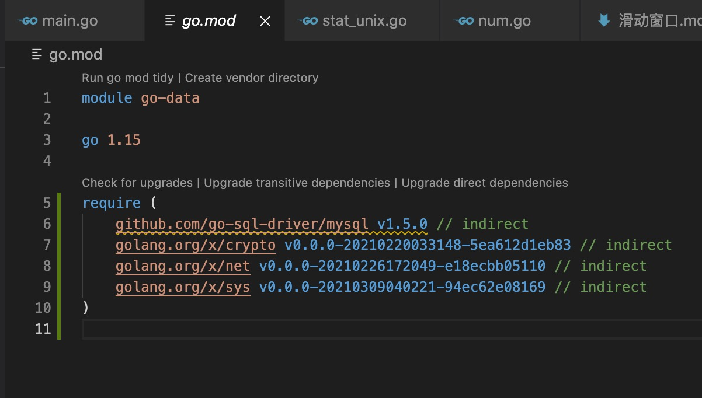
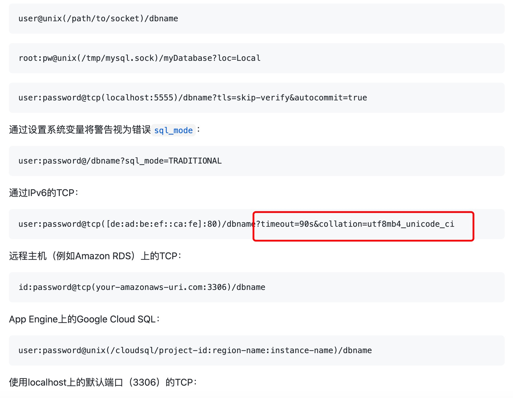

1. Go语言中的database/sql包提供了保证SQL或类SQL数据库的泛用接口，并不提供具体的数据库驱动。使用database/sql包时必须注入（至少）一个数据库驱动

2. mysql 安装第三方驱动，https://github.com/go-sql-driver/mysql/

        go get -u github.com/go-sql-driver/mysql
    
    

3. 使用

   Go MySQL驱动程序是Godatabase/sql/driver接口的实现。您只需要导入驱动程序，然后就可以使用完整的database/sqlAPI。

        import (
            "database/sql"
            _ "github.com/go-sql-driver/mysql"
        )

   > 访问数据库sql.Open()

      要创建一个sql.DB，您可以使用sql.Open()。这将返回一个*sql.DB(指针对象)

      func Open(driverName, dataSourceName string) (*DB, error)

      driverName： 驱动类型，比如mysql,sqlite,postgres 等
      dataSourceName： 数据库连接

        dsn := "user:password@tcp(127.0.0.1:3306)/dbname"

    

4. 占位符 ?(问号)