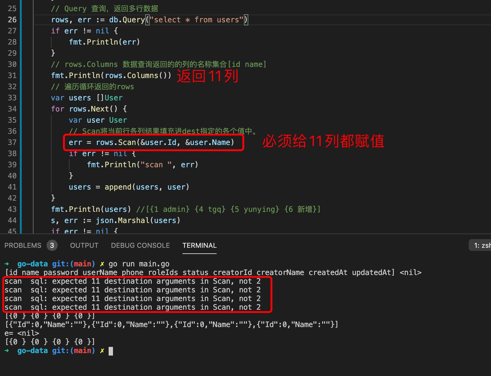
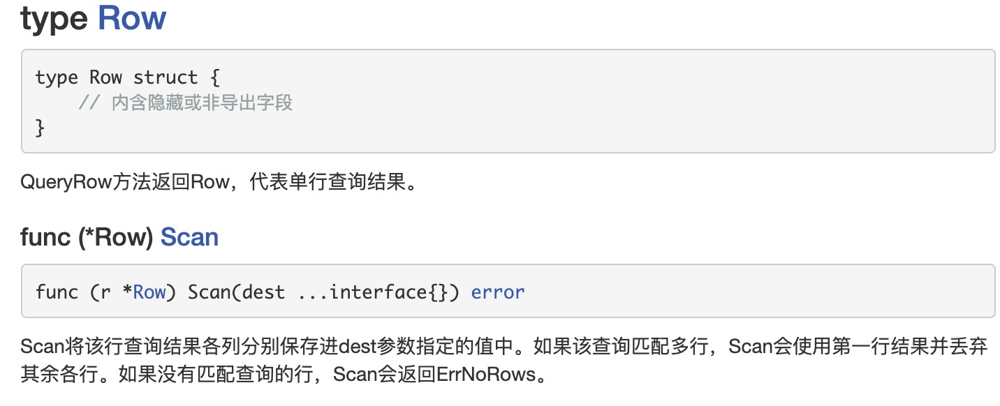
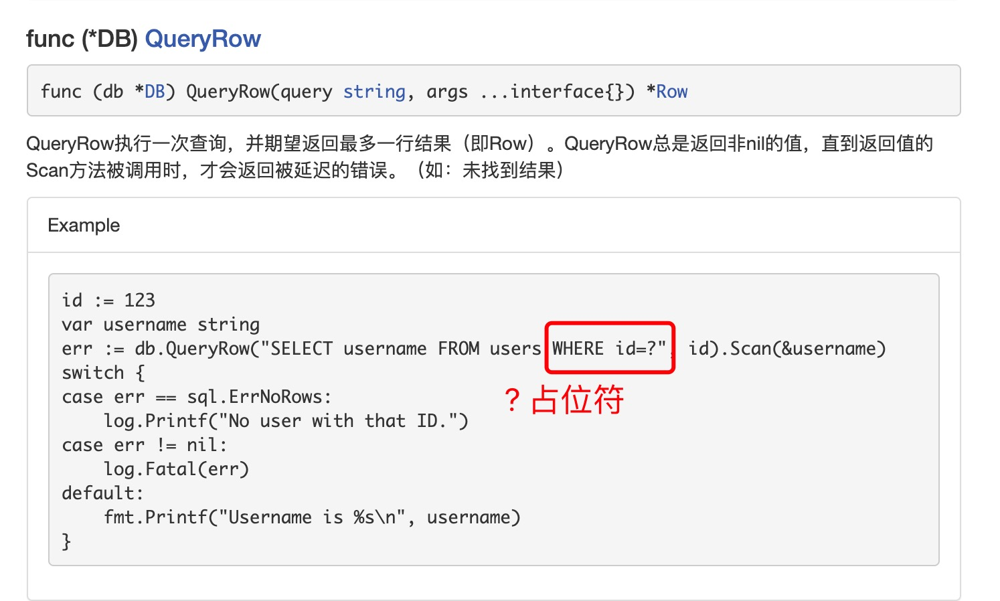
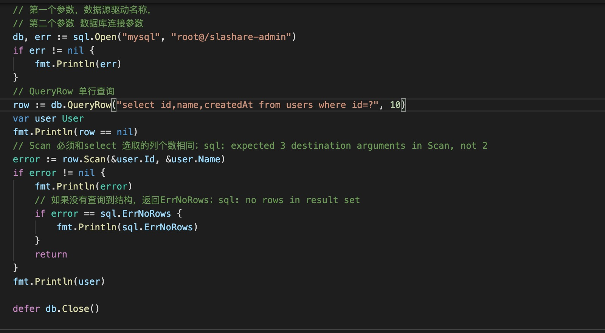

1. 多行查询

   func (db *DB) Query(query string, args ...interface{}) (*Rows, error) 返回rows 结构体指针

   rows:

   
   

2. 实例

   

   scan
   

3. 查询单行数据

   + row结构
   

   + 返回一行,QueryRow

      
      
    