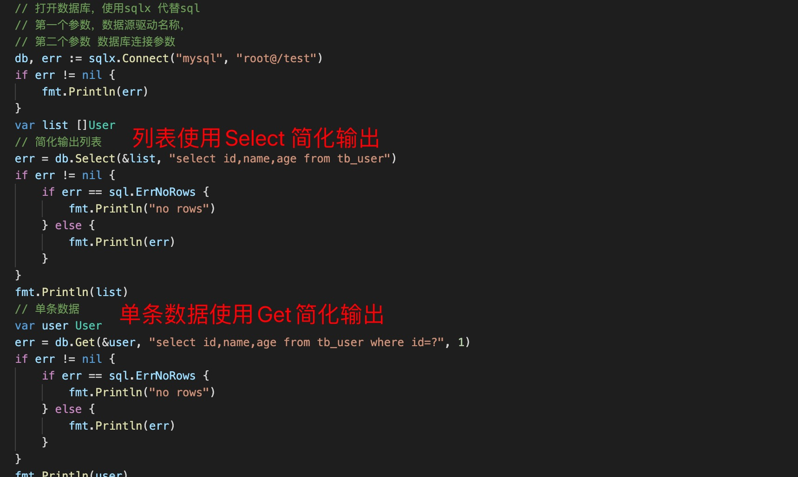
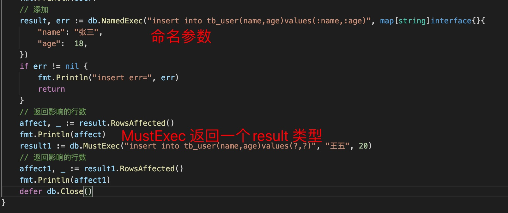
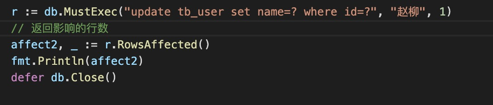

1. sqlx 库是database/sql 库的一个封装，针对database/sql 进行了一些优化，方便快速开发

2. 文档地址

    https://pkg.go.dev/github.com/jmoiron/sqlx#Tx.NamedExec

3. 安装sqlx

        go get github.com/jmoiron/sqlx

4. 查询 select

   

5. 插入数据使用NamedExec 和 MustExec

   

6. 修改

   