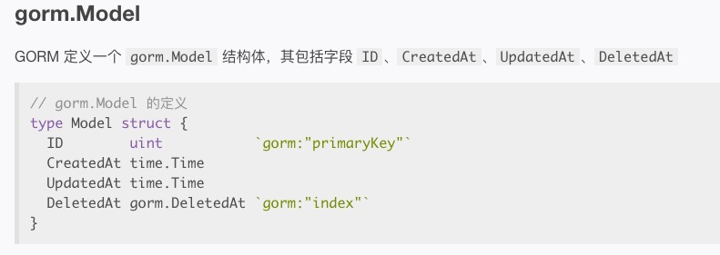
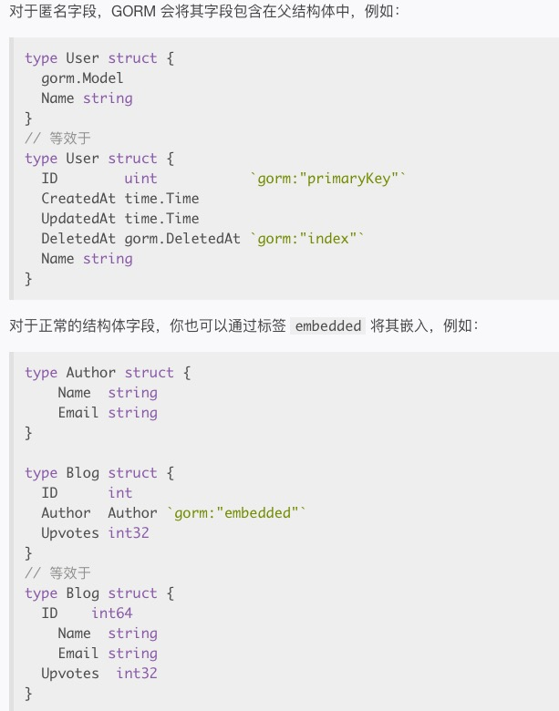

1. gorm 对象就是一个Struct 结构体

        type User struct {
            ID           uint
            Name         string
            Email        *string
            Age          uint8
            Birthday     *time.Time
            // 可为null 的字符串类型，对应数据库中的varchar
            MemberNumber sql.NullString
            // 可为null 的时间类型
            ActivatedAt  sql.NullTime
            CreatedAt    time.Time
            UpdatedAt    time.Time
        }

2. 约定

    默认gorm 使用ID 自增作为主键

    数据表名称为结构体名称的复数小写，比如 User 数据库表名为users

3. gorm.Model 为gorm 提供的包含ID,CreatedAt,UpdatedAt,DeletedAt 

    

    我们可以使用struct 嵌入式结构体，实现继承

    