1. 默认转换mysql 表结构

   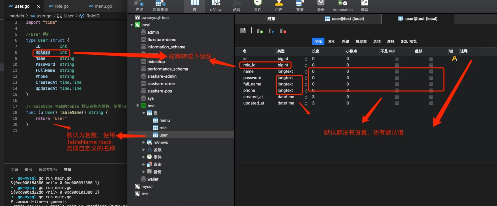

2. mysql 驱动里面配置DefaultStringSize: 

    为string 类型添加默认长度，不然默认使用longtext 类型解析string 类型字段

    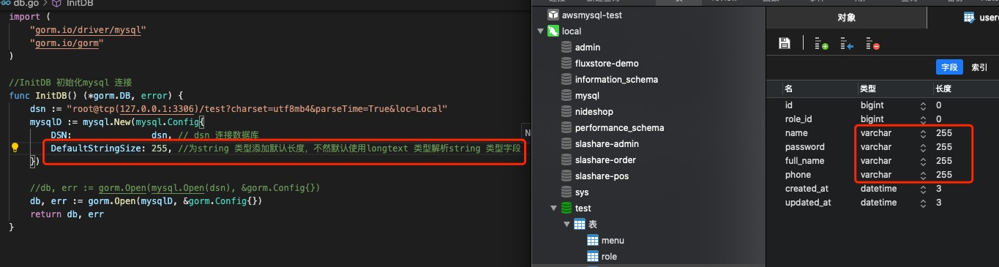

3. 创建表示忽略某字段，使用`gorm:"-"`

   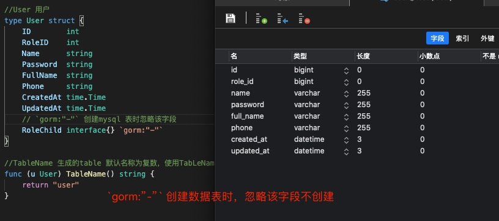

4. 设置表中列的名称

   列的名称默认为结构体中属性字母小写，驼峰形式转成下划线形式，我们可以自定义列名称的显示，使用`gorm:"column:name"`

   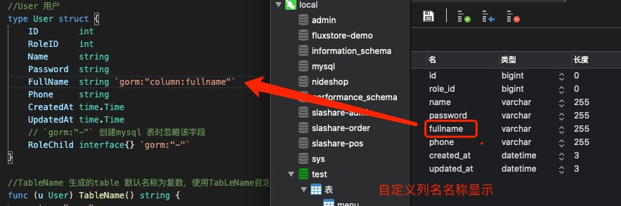

5. 设置列字段类型 `gorm:"type:varchar(1000)"`

   有的不需要长度，比如int

   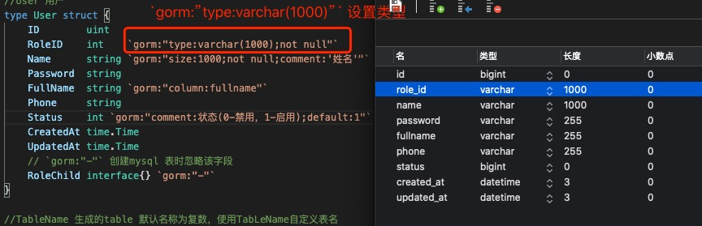

   > 单独设置某个字段的上传 `gorm:"size:1000"`

   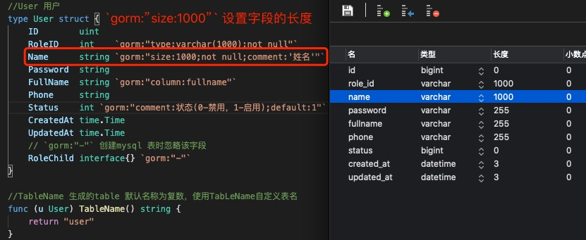

6. 是不是为null, 默认为null ，设置not null（不允许为null）则使用 `gorm:"not null"`

7. 设置注释 `gorm:"comment:姓名"`

   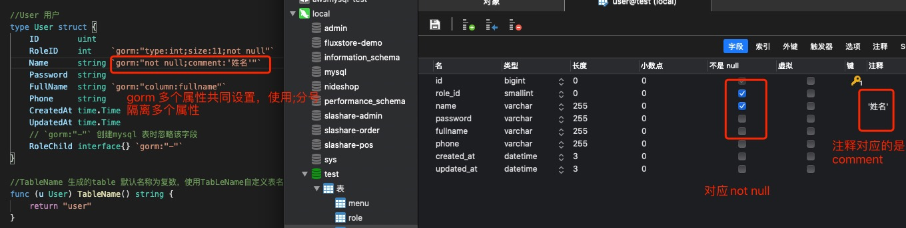

8. 设置字段默认值 `gorm:"default:1"`

    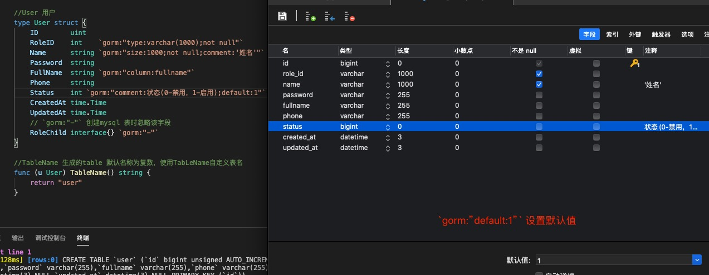

9. 设置小数点，使用`type:decimal(10,2)`

   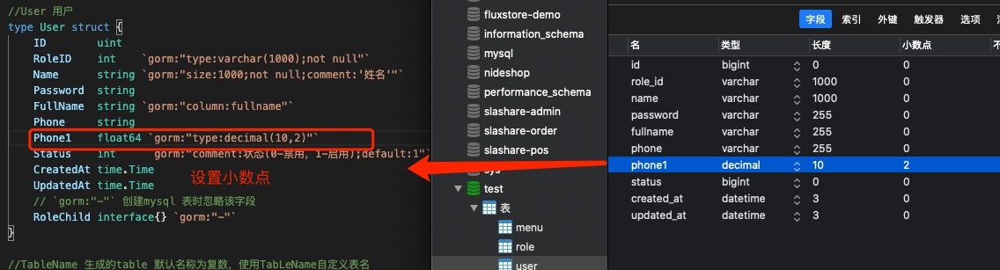

10. 设置自增 ,主键

    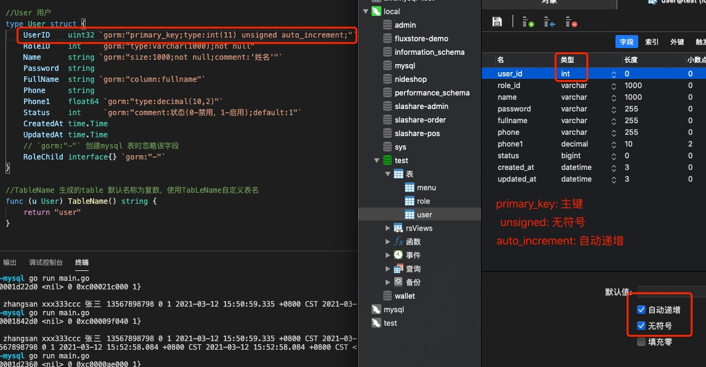

11. 设置索引，使用uniqueindex(唯一索引),index 索引

     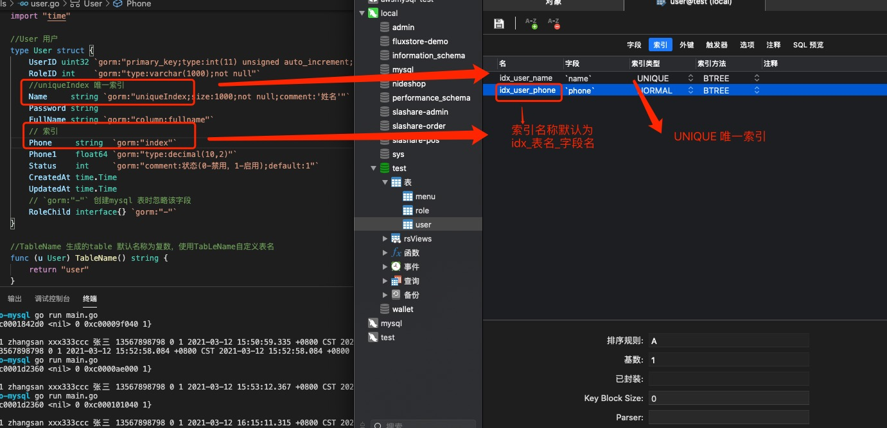

     index 其他设置:

     > 设置索引名称

    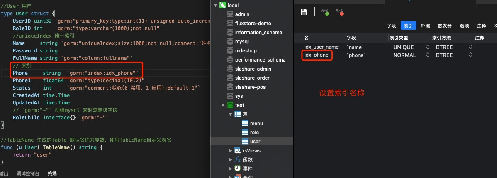

    > 设置索引类型 class

    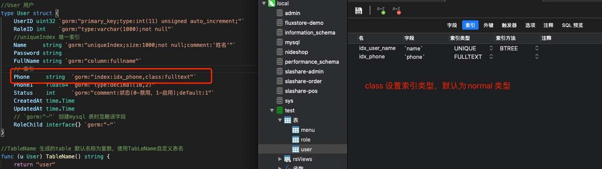

    > 设置索引方法 type

    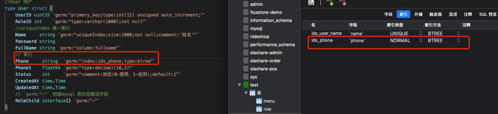

    > 设置排序规则 sort

    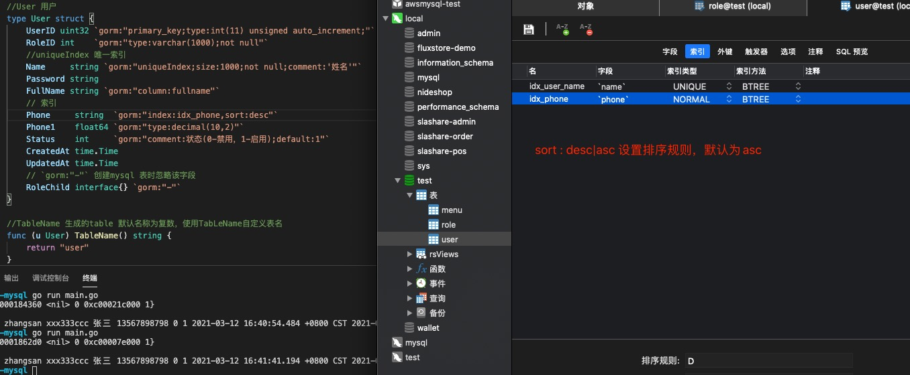

    > 其他：
   
     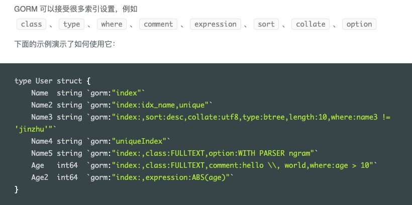

12. 创建表

   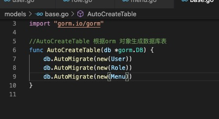
