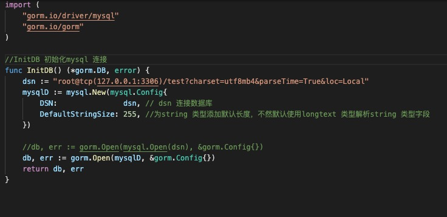
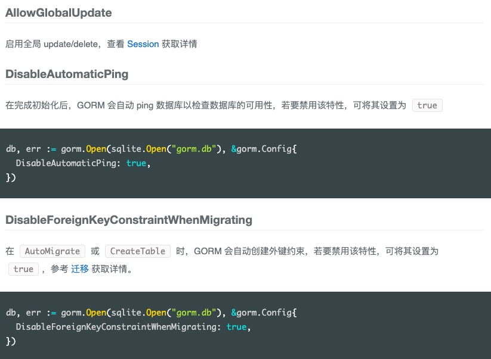

1. gorm 连接数据库需要相应的数据库驱动，以mysql 为例

        安装gorm 和 MySQL 驱动
        // 安装gorm
        go get -u gorm.io/gorm
        // 安装mysql 驱动
        go get -u gorm.io/driver/mysql

2. mysql 连接配置

    

3. gorm 配置

   

   

   
   

4. AllowGlobalUpdate 模式： 全局更新update(没有where条件)，应该禁用，防止程序员出错，导致所有数据都更新

   