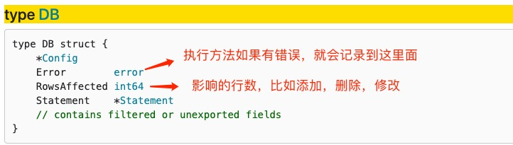
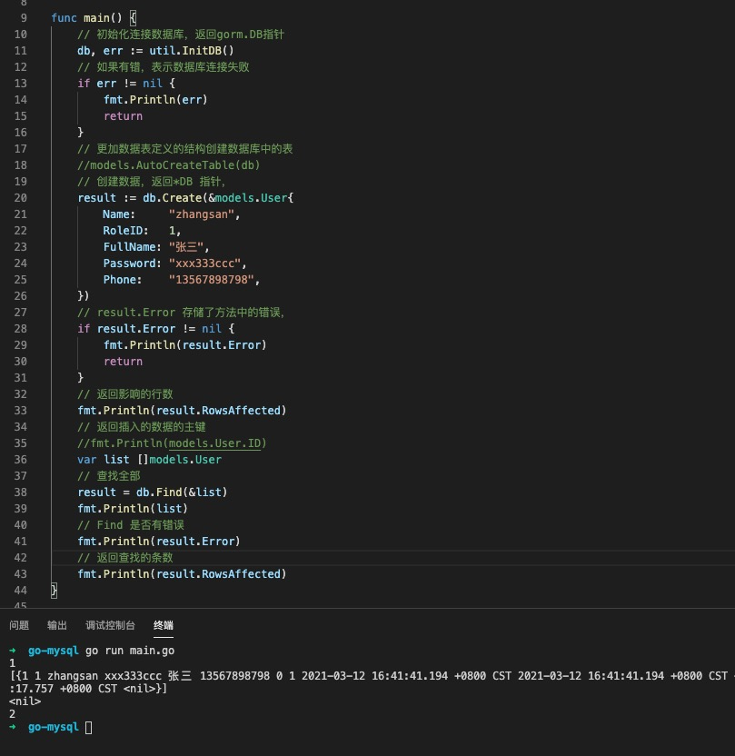

1. gorm 连接数据库以后返回一个DB 对象指针，而大部分操作都在DB 结构中，比如查询，添加，修改，删除，分页，where 等，接收器都是DB 指针

   

2. DB 中的很多方法最后又返回了DB对象，执行方法的错误都放在DB.Error 属性中，判断DB.Error 属性是否为nil 判断是否有错误

   返回DB， 最主要使用了DB.RowsAffected 属性

   