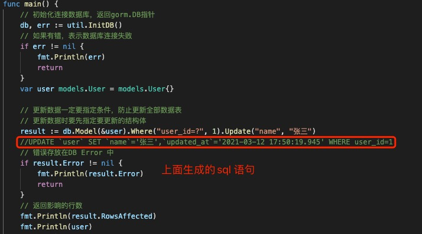
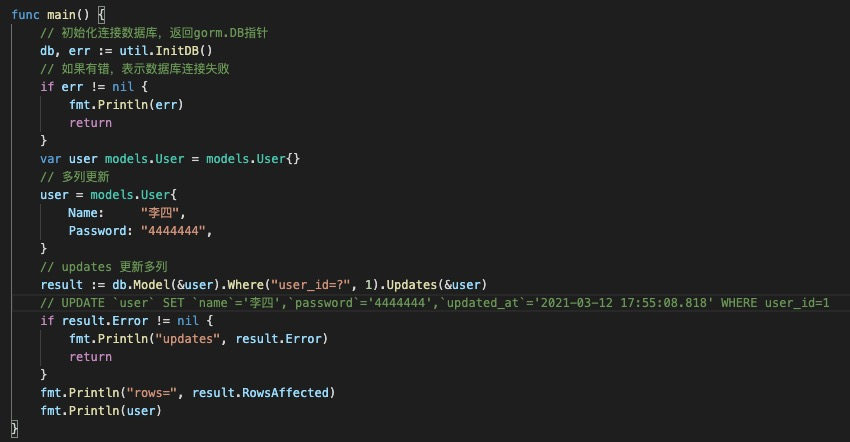

1. gorm 使用update 方法更新数据

   当更新数据时，你需要指定更新条件，防止更新全部数据
   

2. 更新数据时，需要指定你要更新的表

        db.Model(&models.User{}) // 指定更新user 表中数据

        指定要更新的条件，不然会更新整张表

        db.Model(&models.User{}).Where("user_id",1)

3. Update更新单个列的数据

   

4. 一次性更新多列数据，使用Updates

   

5. 注意事项

   > ***在修改数据时，一定要提供条件，不然会更改整张表的数据***