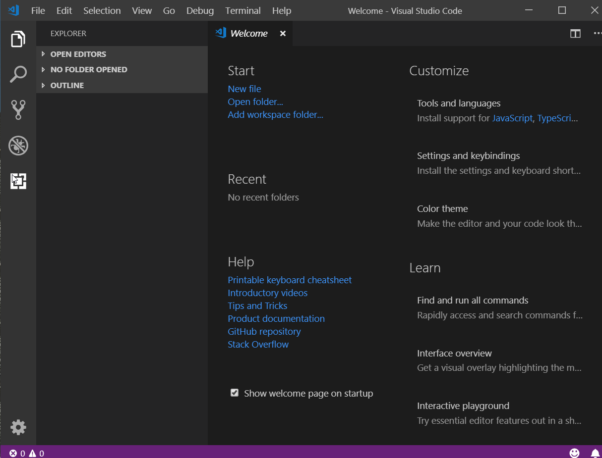
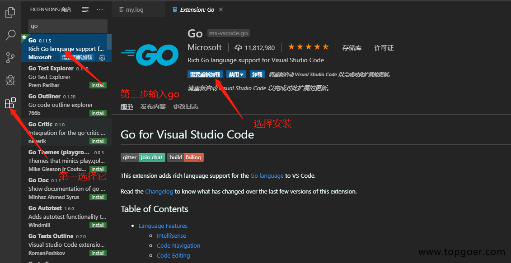
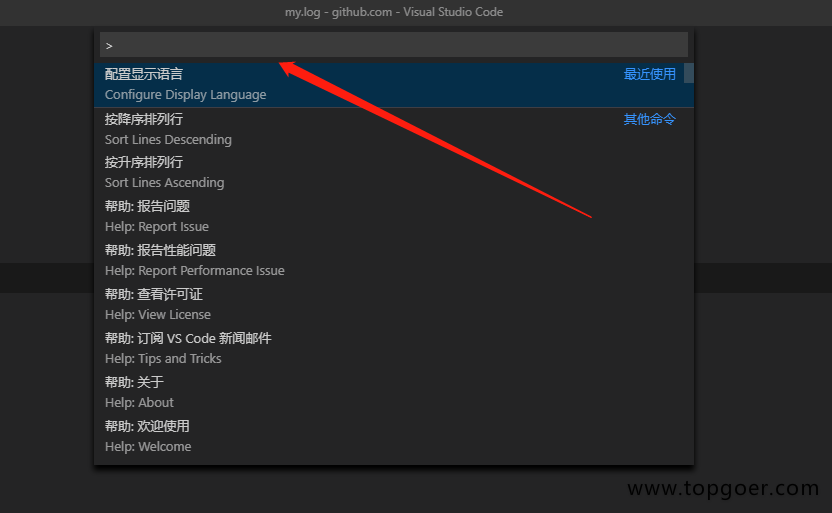
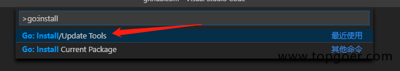
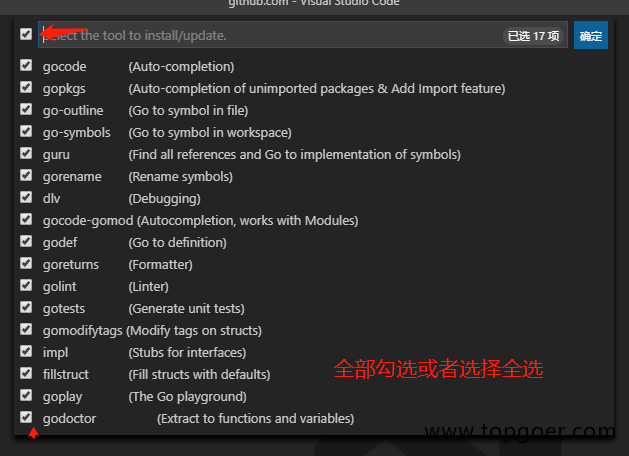

1. vs code 安装和配置go

   在 <a href="https://code.visualstudio.com/" target="_blank">https://code.visualstudio.com/</a> 下载vscode

2. 配置

> 安装中文简体

   点击左侧菜单栏最后一项管理扩展，在搜索框中输入chinese，选中结果列表第一项，点击install安装。

   安装完毕后右下角会提示重启VS Code，重启之后你的VS Code就显示中文啦！

   

> 安装go 插件

   启动vscode选择插件->搜go选择Go for Visual Studio Code插件点击安装即可。如图：

   

> 安装Go语言开发工具包

   在Go语言开发的时候为我们提供诸如代码提示、代码自动补全等功能。

   Windows平台按下Ctrl+Shift+P，Mac平台按Command+Shift+P，这个时候VS Code界面会弹出一个输入框，如下图：
 
   

   我们在这个输入框中输入>go:install，下面会自动搜索相关命令，我们选择Go:Install/Update Tools这个命令

   

   选中并会回车执行该命令（或者使用鼠标点击该命令）

   

   VS Code此时会下载并安装上图列出来的16个工具，但是由于国内的网络环境基本上都会出现安装失败

3. 解决办法

   使用git下载源代码再安装

   我们可以手动从github上下载工具，(执行此步骤前提需要你的电脑上已经安装了git)

   第一步：现在自己的GOPATH的src目录下创建golang.org/x目录

   第二步：在终端/cmd中cd到GOPATH/src/golang.org/x目录下

   第三步：执行git clone https://github.com/golang/tools.git tools命令

   第四步：执行git clone https://github.com/golang/lint.git命令

   第五步：按下Ctrl/Command+Shift+P再次执行Go:Install/Update Tools命令，在弹出的窗口全选并点击确定，这一次的安装都会SUCCESSED了。

   经过上面的步骤就可以安装成功了。 这个时候创建一个Go文件，就能正常使用代码提示、代码格式化等工具了。

