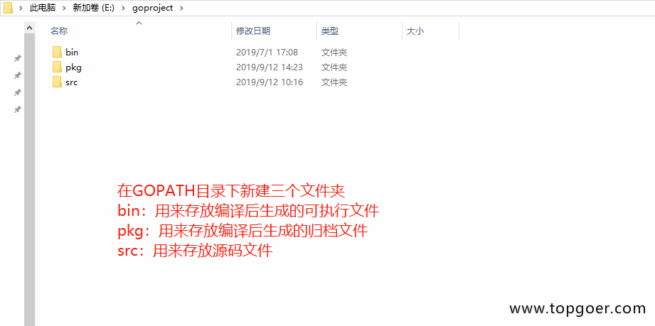

1. 在gopath 目录中创建三个文件夹

   

2. 常见hello 

   在src目录下创建一个hello目录，在hello目录中创建一个main.go文件

        package main  // 声明 main 包，表明当前是一个可执行程序

        import "fmt"  // 导入内置 fmt 

        func main(){  // main函数，是程序执行的入口
            fmt.Println("Hello World!")  // 在终端打印 Hello World!
        }

3. 运行go

        go run main.go 

4. 编译go文件

        go build

    go编译器会去 GOPATH的src目录下查找你要编译的hello项目

    编译得到的可执行文件会保存在执行编译命令的当前目录下，如果是windows平台会在当前目录下找到hello.exe可执行文件。

    我们还可以使用-o参数来指定编译后可执行文件的名字。

        go build -o heiheihei.exe

   在终端直接执行该hello.exe文件：

       d:\goproject\src\hello>hello.exe
        Hello World!
