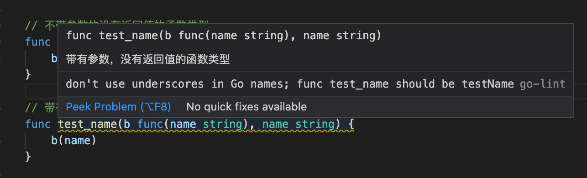

1. go 语言是静态类型(强类型语言)编译型语言

    go 语言遵循驼峰式写法

    

2. go 语言后缀名为.go

3. go 语言不需要用分号结尾，go 使用行语句作为分隔符，即一行一个语句。如果在一行上写多行语句，则必须用分号隔离

        import "fmt"; import "os"

        import ("fmt"; "os")

4. 注释

+ // 单行注释

+ /**/ 多行注释

5. go 语言必须先声明包

        package main

   ***每个 Go 文件都属于且仅属于一个包。一个包可以由许多以 .go 为扩展名的源文件组成，因此文件名和包名一般来说都是不相同的***

   ***你必须在源文件中非注释的第一行指明这个文件属于哪个包，如：package main***

   ***如果一个 go 应用程序想打包成可执行的二进制文件，那么必须包含一个main 包，在main 包中必须有一个main 入口函数，入口函数没有参数和返回值。***

   属于同一个包的源文件必须全部被一起编译，一个包即是编译时的一个单元，因此根据惯例，每个目录都只包含一个包。

   当你导入多个包时，最好按照字母顺序排列包名，这样做更加清晰易读。

   如果包名不是以 . 或 / 开头，如 "fmt" 或者 "container/list"，则 Go 会在全局文件进行查找；如果包名以 ./ 开头，则 Go 会在相对目录中查找；如果包名以 / 开头（在 Windows 下也可以这样使用），则会在系统的绝对路径中查找。