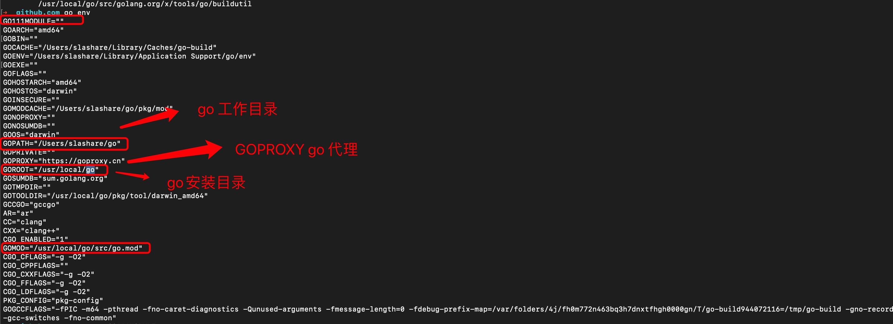
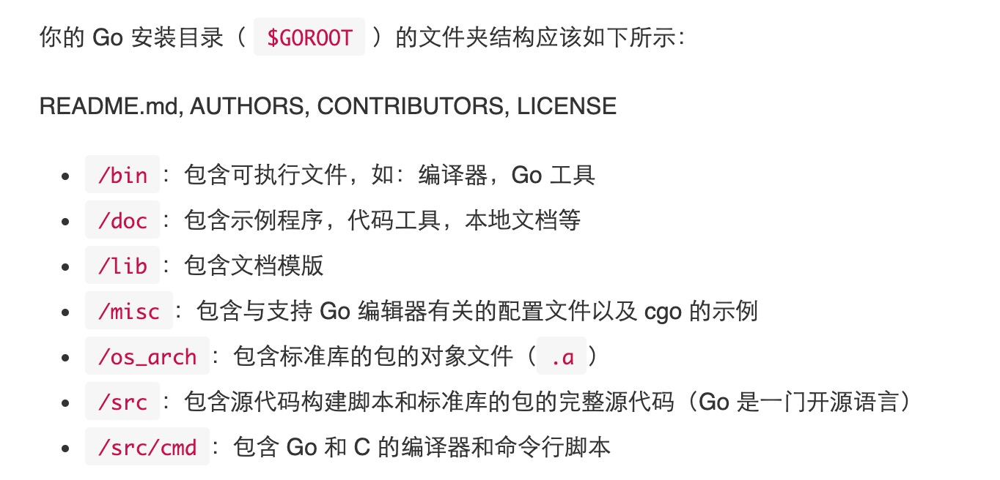

0. go env 查看go 环境变量

        go env 

   

   > GOROOT go 安装目录

   

1. go build 编译go 应用程序

        go build main.go 

        编译后会在本地文件夹下生成一个二进制文件：main 或者 main.exe（Windows系统）

        执行二进制
        ./main

2. go run 运行go 命令

        go run main.go 

        go run main.go test(传参)

3. go mod inti 初始化包

        go mod init ProjectName

        会创建一个go.mod 文件

                module learn

                go 1.15

                // 引入第三方包
                require golang.org/x/crypto v0.0.0-20201221181555-eec23a3978ad
        
        Golang 编译器会将这个项目认为是包 ProjectName 