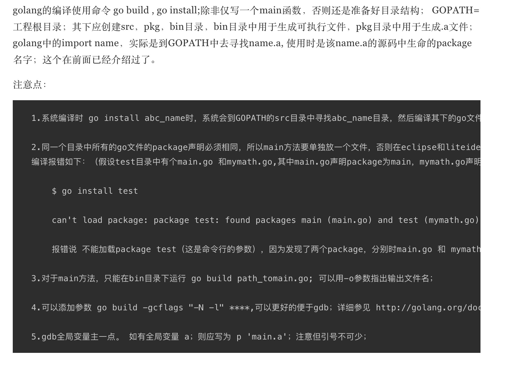

0. go env 查看go 环境变量

        go env 

   

   > GOROOT go 安装目录

   

   + $GOROOT 表示 Go 在你的电脑上的安装位置，它的值一般都是 $HOME/go，当然，你也可以安装在别的地方

   + $GOPATH 默认采用和 $GOROOT 一样的值，但从 Go 1.1 版本开始，你必须修改为其它路径。它可以包含多个包含 Go 语言源码文件、包文件和可执行文件的路径，***而这些路径下又必须分别包含三个规定的目录：src、pkg 和 bin，这三个目录分别用于存放源码文件、包文件和可执行文件***

   > 设置环境变量

        go env -w GOPATH=/usr/test/go

1. go build 编译go 应用程序

        go build main.go 

        编译后会在本地文件夹下生成一个二进制文件：main 或者 main.exe（Windows系统）

        执行二进制
        ./main

   

2. go run 运行go 命令

        go run main.go 

        go run main.go test(传参)

3. go mod inti 初始化包

        go mod init ProjectName

        会创建一个go.mod 文件

                module learn

                go 1.15

                // 引入第三方包
                require golang.org/x/crypto v0.0.0-20201221181555-eec23a3978ad
        
        Golang 编译器会将这个项目认为是包 ProjectName 

4. 格式化代码 go fmt

        gofmt –w program.go

5. 生成代码文档 go doc

6. go env用于打印Go语言的环境信息。

7. go run命令可以编译并运行命令源码文件。

8. go get可以根据要求和实际情况从互联网上下载或更新指定的代码包及其依赖包，并对它们进行编译和安装。

9. go build命令用于编译我们指定的源码文件或代码包以及它们的依赖包。

10. go install用于编译并安装指定的代码包及它们的依赖包。

11. go clean命令会删除掉执行其它命令时产生的一些文件和目录。

12. go doc命令可以打印附于Go语言程序实体上的文档。我们可以通过把程序实体的标识符作为该命令的参数来达到查看其文档的目的。

13. go test命令用于对Go语言编写的程序进行测试。

14. go list命令的作用是列出指定的代码包的信息。

15. go fix会把指定代码包的所有Go语言源码文件中的旧版本代码修正为新版本的代码。

16. go vet是一个用于检查Go语言源码中静态错误的简单工具。

17. go tool pprof命令来交互式的访问概要文件的内容