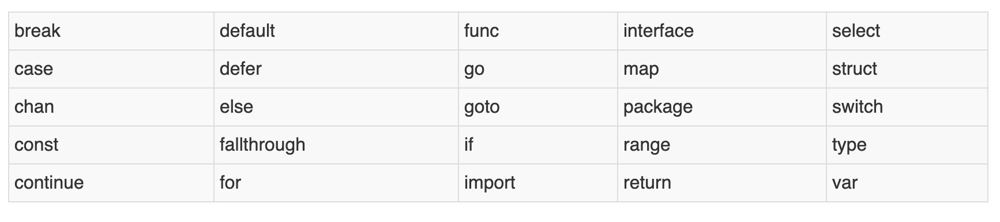

1. go 是强类型语言，因此声明变量要带类型（定义时不带赋值的）,而且变量类型确定以后，变量只能存储此类型的值。

    比如： 如果定义了一个变量为string 类型，那么以后给这个变量赋值时，只能是字符串类型

            var a string 

            a="hello" // 正确

            a=123 // 错误

            cannot use 123 (type untyped int) as type string in assignment

2. ***在go语言中变量必须先声明在使用，不然会报错***

        a = 123 //./main.go:5:2: undefined: a

3. 在函数中声明了变量，必须使用，不然会报错

        func main(){
            a := 123
        }

        ./main.go:5:2: a declared but not used

4. 标识符：字母或下划线开头的，有数字，字母，下划线组成的，不能是go 语言中的关键字

   ***Go 语言也是区分大小写的***

        var A string 

        var a int

        // 两个不同的变量

   

4. 声明变量使用var 声明

+ var 声明格式，go 语言中有默认值

        var 变量名 变量类型

        // 在go 语言中声明了变量会有默认值

        var a int // 默认值为0，此时a=0

        var (
                a int
                b bool
                str string
        )

        当一个变量被声明之后，系统自动赋予它该类型的零值：int 为 0，float 为 0.0，bool 为 false，string 为空字符串，指针为 nil。记住，所有的内存在 Go 中都是经过初始化的

+ 在函数中可以使用简单写法 :=

        a:="hello" 

        是

        var a ="hello" 的简写

        类型使用的是go 语言中的类型推导

   > 简单写法缺点

   + 只能用于函数中，不能用于声明全局变量

   + 定义变量时，必须赋值，类型根据值推导

   + 不能显示声明变量的类型，比如数字默认是int 型，我想使用int64, 这种情况下可以使用标准类型

        var a int64 =0

+ 多重声明，在go 语言中当类型相同时，可以一起定义

        var a,b string 
        //等同于下面

        var a string

        var b string

        函数参数

        func test(a,b int){

        }

+ 多重赋值，可以一次性给多个变量赋值，

        x,y =1,10

        // 借助多重赋值的特性，可以很方便的交换两个变量的值

        x,y =y,x

5. 简短写法规则

+ 当左边有新变量时，声明过的变量可以重复声明

        field1, offset := nextField(str, 0)

        field2, offset := nextField(str, offset)

        当:=左侧存在新变量时（如field2），那么已声明的变量（如offset）则会被重新声明，不会有其他额外副作用。

        当:=左侧没有新变量是不允许的，编译会提示no new variable on left side of :=

        func fun1() {
                i := 0
                i, j := 1, 2
                fmt.Printf("i = %d, j = %d\n", i, j)
        }

        i=1,j=2

+ 函数参数也是一个变量，声明变量时不能有和参数同名的变量

        func fun2(i int) {
                i := 0
                fmt.Println(i)
        }
        ./main.go:6:4: no new variables on left side of :=

        在:=左边没有新的变量，而变量i 在参数中已经声明过了

+ 变量的作用域是{} 花括号

        花括号里面可以访问外面的变量，外面的变量不可以访问花括号里面的变量

        func fun3() {
                i, j := 0, 0
                if true {
                        j, k := 1, 1
                        fmt.Printf("j = %d, k = %d\n", j, k)
                }
                fmt.Printf("i = %d, j = %d\n", i, j)
        }

6. 变量作用域

   个变量（常量、类型或函数）在程序中都有一定的作用范围，称之为作用域。
   
   + 如果一个变量在函数体外声明，则被认为是全局变量，可以在整个包甚至外部包（被导出后）使用，不管你声明在哪个源文件里或在哪个源文件里调用该变量。

   + 在函数体内声明的变量称之为局部变量，它们的作用域只在函数体内，参数和返回值变量也是局部变量。像 if 和 for 这些控制结构，而在这些结构中声明的变量的作用域只在相应的代码块({})内。一般情况下，局部变量的作用域可以通过代码块（用大括号括起来的部分）判断。  

   尽管变量的标识符必须是唯一的，***但你可以在某个代码块的内层代码块中使用相同名称的变量，则此时外部的同名变量将会暂时隐藏（结束内部代码块的执行后隐藏的外部同名变量又会出现，而内部同名变量则被释放）***，你任何的操作都只会影响内部代码块的局部变量

7. go 的类型自动推导是在编辑期确定的