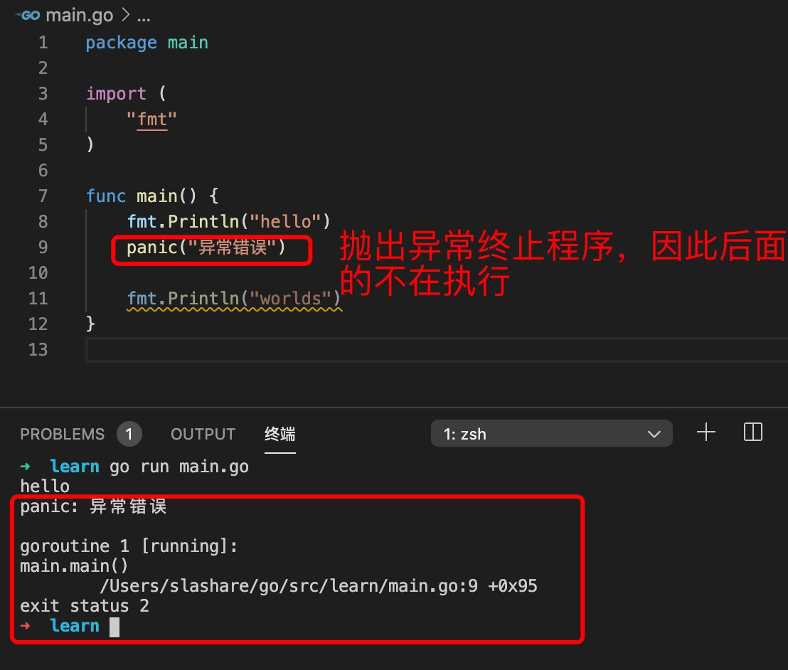
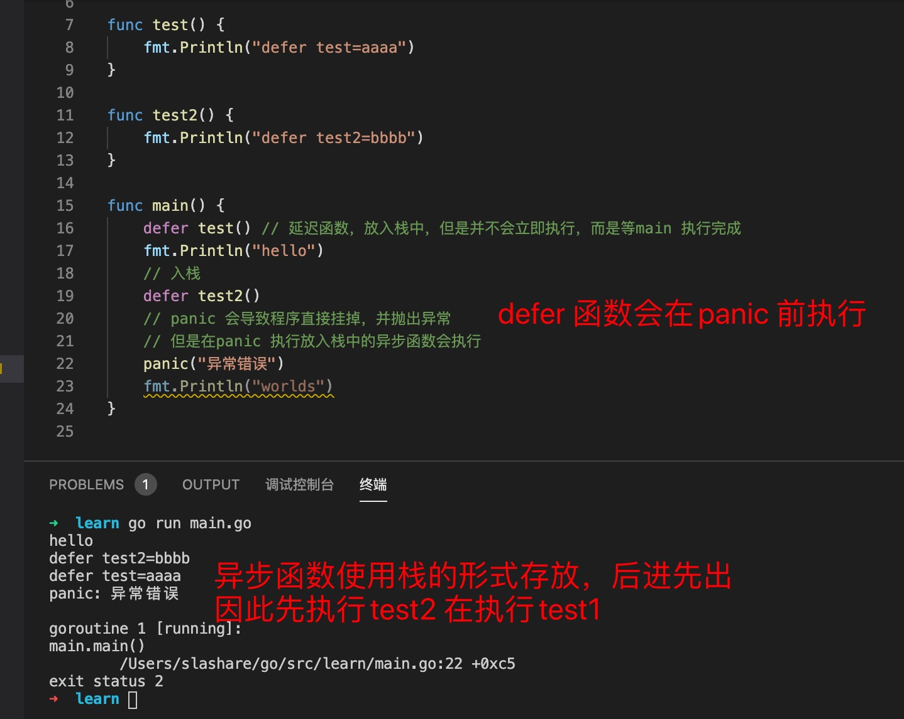
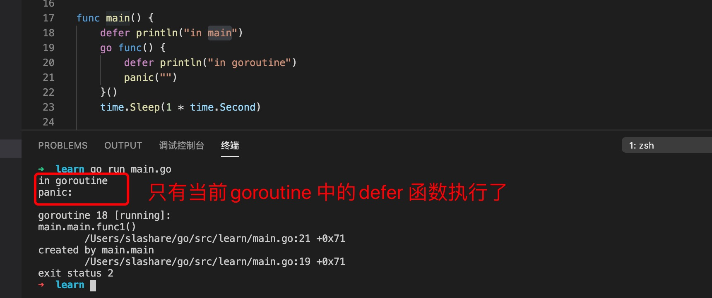
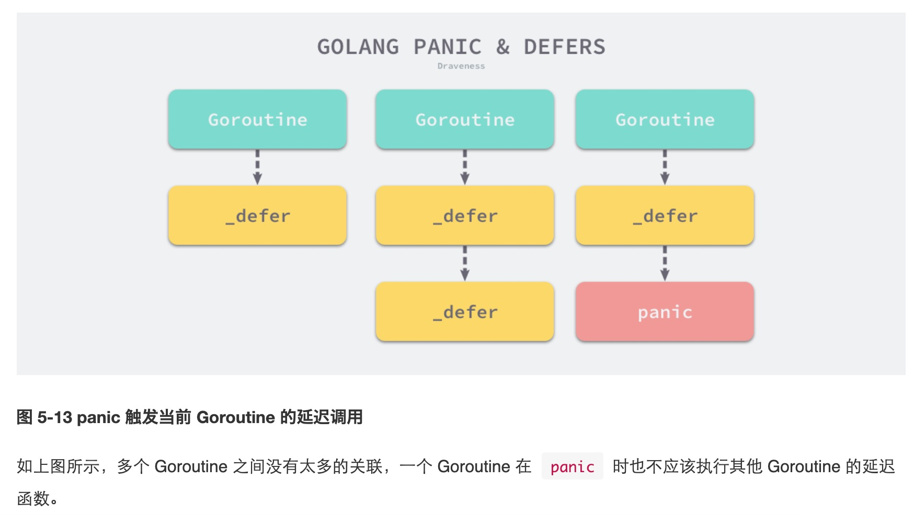

1. panic 类似其他语言的throw error ，抛出异常，如果没有recover 会直接终止程序运行，并返回错误

   

   panic代表程序运行终止，但是已经“生效”的延迟函数仍会执行（即已经压入栈的defer延迟函数，panic之前的），defer 函数会在panic 之前运行

   

2. recover 可以中止 panic 造成的程序崩溃。***它是一个只能在 defer 中发挥作用的函数，在其他作用域中调用不会发挥任何作用；***

   

3. ***painc 只会在当前goroutine的延迟函数调用***

   

   

