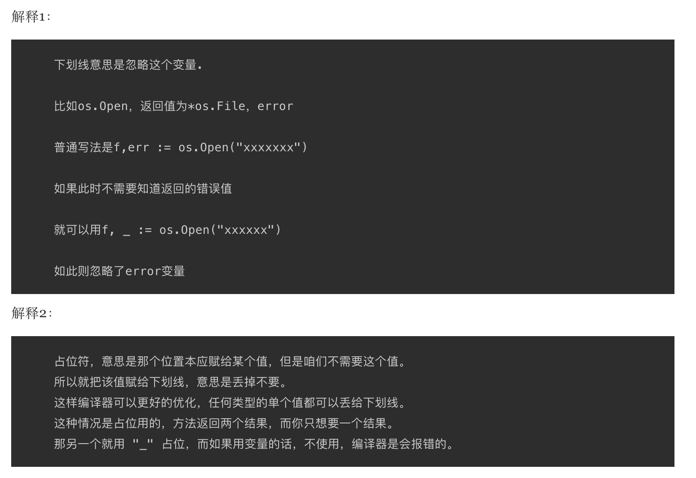

1. go 语言中的特殊字符下划线

   >下划线在import中

    import 下划线（如：import hello/imp）的作用：当导入一个包时，该包下的文件里所有init()函数都会被执行，然而，有些时候我们并不需要把整个包都导入进来，仅仅是是希望它执行init()函数而已。这个时候就可以使用 import 引用该包。***即使用【import _ 包路径】只是引用该包***，仅仅是为了调用init()函数，所以无法通过包名来调用包中的其他函数

            package main

            import _ "./hello" // 只执行hello 模块中的init 函数

            func main() {
                // hello.Print() 
                //编译报错：./main.go:6:5: undefined: hello
            }
    
   > 下划线在代码中

            func main() {
                buf := make([]byte, 1024)
                f, _ := os.Open("/Users/***/Desktop/text.txt")
                defer f.Close()
                for {
                    n, _ := f.Read(buf)
                    if n == 0 {
                        break    

                    }
                    os.Stdout.Write(buf[:n])
                }
            }
    
    