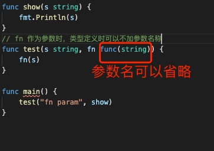
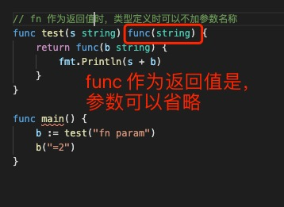
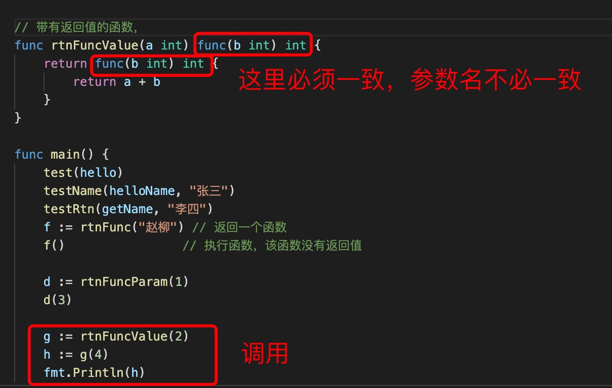
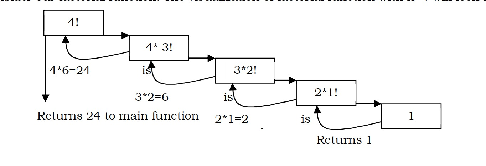

1. 在 go 语言中函数使用func 关键字定义,go 中函数是一级对象，可以作用返回值，参数，匿名函数等

        func methodName(param type[, param1 type] ) (返回值类型){

        }

        func functionName(parameter_list) (return_value_list) {
             …
        }

         参数说明：

           parameter_list 的形式为 (param1 type1, param2 type2, …)

           return_value_list 的形式为 (ret1 type1, ret2 type2, …)

        // 函数变量的定义
        func() // 没有返回值，没有参数

        func(name string) // 有参数，没有返回值

        func(name string) string // 有参数有返回值

2. go 语言中函数不支持函数重载(即在同一个包中可以有重名的函数),不支持参数默认值，不支持命名参数

3. go 支持返回多个值

        // (string,string) 是每个返回值的类型
        func getNames() (string,string){
            return "Hello","world"
        }

        func test() (string,int){
            return "Hello",2
        }

4. 参数简写

    如果相邻几个参数类型一致，可以使用参数类型简写

        func test(x,y,z int){

        }

5. 变成参数

   如果参数类型相同，可以使用... 声明不定量参数，参数返回这个类型的切片

        func test(nums... int){
            // nums 是 []int int 类型的切片
        }

        // 调用

        test(1,2,3,4)

        test([]int{1,2,3,4}...)

6. 函数作为参数

        func hello() {
            fmt.Println("hello")
        }

        func helloName(name string) {
            fmt.Println("hello_name:", name)
        }

        func getName(name string) string {
            return name
        }

        // 不带参数的没有返回值的函数类型
        func test(b func()) {
            b() // 执行函数
        }

        // 带有参数，没有返回值的函数类型
        func testName(b func(name string), name string) {
            b(name)
        }

        // 带有参数，且有返回值的函数类型
        func testRtn(a func(name string) string, name string) {
            b := a(name)
            fmt.Println("return value func:", b)
        }

        func main() {
            test(hello)
            testName(helloName, "张三")
            testRtn(getName, "李四")
        }

   

7. 函数作为返回值

   

+ 返回一个函数，该函数没有返回值没有参数

        // 函数作为返回值func()
        func rtnFunc(name string) func() {
            return func() {
                fmt.Println(name)
            }
        }

        f := rtnFunc("赵柳") // 返回一个函数
	    f()                // 执行函数，该函数没有返回值

+ 返回一个带有参数的返回值

        // 返回一个带有参数的函数 func(b int)
        func rtnFuncParam(a int) func(b int) {
            return func(b int) {
                fmt.Println(a + b)
            }
        }

        d := rtnFuncParam(1)
	    d(3)
        // 函数式编程

+ 返回一个带有参数，且有返回值的

     

8. 命名返回

        // 命名返回，n,s 
        func returnMultiple() (n int, s string) {
            n = 19
            s = "value1"
            // n and s will be returned
            return
        }
        var x, str = returnMultiple()

9. 函数变量

        sub := func(a, b int) int {
            return a - b
        }
        // use the name to call the function
        fmt.Println(sub(6, 3))

10. 函数闭包

        func outer() (func() int, int) {
            outer_var := 2
            inner := func() int {
                outer_var += 99 // attempt to mutate outer_var from outer scope
                return outer_var // => 101 (but outer_var is a newly redefined variable visible only inside inner)
            }
            return inner, outer_var // => 101, 2 (outer_var is still 2, not mutated by foo!)
        }

11. 递归

   函数自己调用函数自己本身

        func print(n int) int {
            if n == 0 {
                return 0 // this is the terminating base case
            }
            fmt.Println(n)
            return print(n - 1) // recursive call to itself again
        }

   

12. defer 关键字的作用是当外围函数返回之后才执行被推迟的函数

        func test(){
            fmt.Println("test")
        }
        func main(){
            defer test()
            fmt.Println("hello")
        }
        defer 是当main 执行完成以后才执行test 函数

        func b() {

            for i := 0; i < 4; i++ {
                //推迟调用的函数其参数会立即求值
                // 推迟的函数调用会被压入一个栈中。当外层函数返回时，被推迟的函数会按照后进先出的顺序调用
                defer fmt.Print(i)
            }
        }