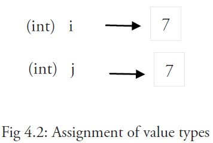
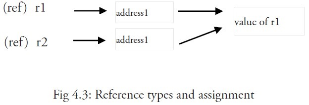

1. 值类型变量直接指向存在内存中的值

   在go语言中，int,bool,string,float,数组和结构都是值类型。

   当使用等号 = 将一个变量的值赋值给另一个变量时，如：j = i，实际上是在内存中将 i 的值进行了拷贝(拷贝值的一个副本给新的变量，与原来的变量没有任何关联)：

   

        func learnValue(a int, b bool, c float64, d string, e [4]int, g good) {
            fmt.Printf("a1=%p\n", &a)
            fmt.Printf("b1=%p\n", &b)
            fmt.Printf("c1=%p\n", &c)
            fmt.Printf("d1=%p\n", &d)
            fmt.Printf("e1=%p\n", &e)
            fmt.Printf("g1=%p\n", &g)
        }

        type good struct {
            name  string
            count int
        }

        func showValue() {
            a := 1
            b := true
            c := 6.5
            d := "hello"
            e := [4]int{1, 2, 3, 4}
            g := good{"hello", 10}
            fmt.Printf("a=%p\n", &a)
            fmt.Printf("b=%p\n", &b)
            fmt.Printf("c=%p\n", &c)
            fmt.Printf("d=%p\n", &d)
            fmt.Printf("e=%p\n", &e)
            fmt.Printf("g=%p\n", &g)
            learnValue(a, b, c, d, e, g)
        }
        a=0xc000012090
        b=0xc000012098
        c=0xc0000120a0
        d=0xc000010200
        e=0xc000018160
        g=0xc00000c060
        a1=0xc0000120c0
        b1=0xc0000120c8
        c1=0xc0000120d0
        d1=0xc000010210
        e1=0xc000018180
        g1=0xc00000c080

        两边打印的地址不一样，表示存储的位置不一样

2. 引用类型指向内存中的地址

   在go语言中，指针类型，slice, map ，channel 都是引用类型。

   当使用赋值语句 r2 = r1 时，只有引用（地址）被复制。

   如果 r1 的值被改变了，那么这个值的所有引用都会指向被修改后的内容，在这个例子中，r2 也会受到影响。

   

        func learnReference(p *int, a []string, b map[string]string) {
            fmt.Printf("p1=%p\n", p)
            fmt.Printf("a1=%p\n", a)
            fmt.Printf("b1=%p\n", b)
        }
        func showReference() {
            p := new(int)
            a := []string{"hello", "aa"}
            b := map[string]string{"name": "123"}
            fmt.Printf("p=%p\n", p)
            fmt.Printf("a=%p\n", a)
            fmt.Printf("b=%p\n", b)
            learnReference(p, a, b)
        }

        p=0xc000012090
        a=0xc00000c060
        b=0xc000064180
        p1=0xc000012090
        a1=0xc00000c060
        b1=0xc000064180

        两边的地址是一样的

        比如slice其实是数组的一种指针

3. 引用类型如果在函数中重新赋值，表示切断原来的位置，重新开辟一块新的内存

        func learn2(a []int) {
            fmt.Printf("param a=%p\n", a) // slice 是引用类型，传递的是内存地址
            a[0] = 3 // 引用传值，对数据的修改会影响原变量的值，
            fmt.Printf("param a=%p\n", a)
            a = []int{1, 2, 3} // 重新赋值，重新开辟一块新的内存，与原来的变量再没有任何关系
            fmt.Printf("new a=%p\n", a)
        }

        func main() {
            //showReference()
            a := []int{1, 2, 3}
            fmt.Printf("init a=%p\n", a)
            learn2(a)
            fmt.Println(a)
        }

        init a=0xc000118020
        param a=0xc000118020
        new a=0xc000118060
        [3 2 3]
