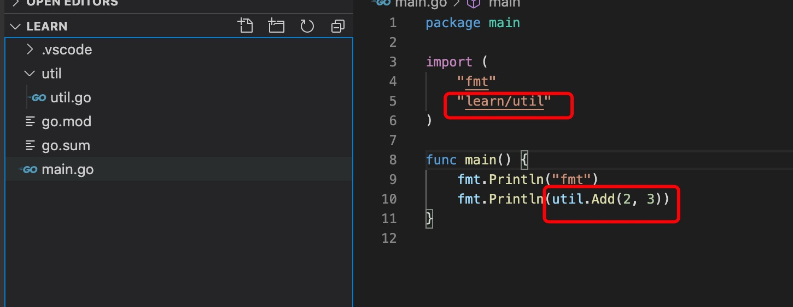
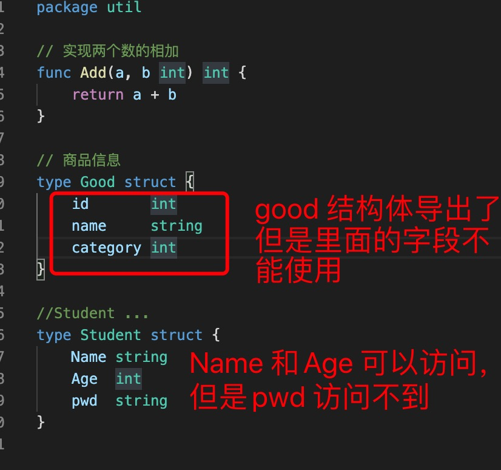
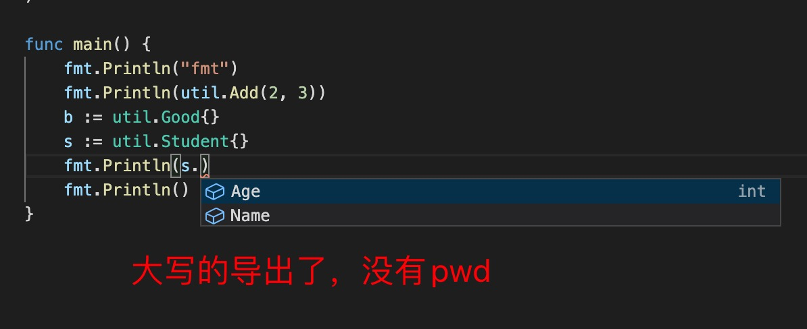

1. 在go 语言中如果程序是一个可以编译成可执行的二进制文件，那么必须有一个main 包，并且在main 包里面有一个main 入口函数

   也就是说main 函数必须在main 包里面

   比如：

        // go 程序入口包必须为main
        package main

        // 导入其他地方的包，包通过go mod 机制寻找

        import (
            "fmt"
        )

        // 每个包里面都有一个init 函数
        // init函数在main函数之前执行
        func init(){

        }

        // 程序入口必须为main 函数，main 函数没有参数，也没有返回值
        // main 函数必须在main 包里面
        func main(){
            fmt.Println("hello world")
        }
        
2. 包或者库，在go 语言中使用包管理新机制 go mod

   每一个*.go 源码文件，必须属于一个包，即第一句声明包

3. go mod init 初始化包

        go mod init learn
    
    

    Golang 编译器会将这个项目认为是包 learn，这是整个项目最上层的包，而底下的文件夹 util 作为 package util，包名全路径就是 golang/util

        在package main 中导入包

        import (
            "fmt"
            "learn/util"
        )

4. 包中变量要想被外部访问，就需要在导出，不然外部即使import 导入了也不能访问

   ***go 语言中使用首字母大写形式表示导出，对于结构体来说，如果想要字段也导出，则必须字段首字母也要大写。***

   
   