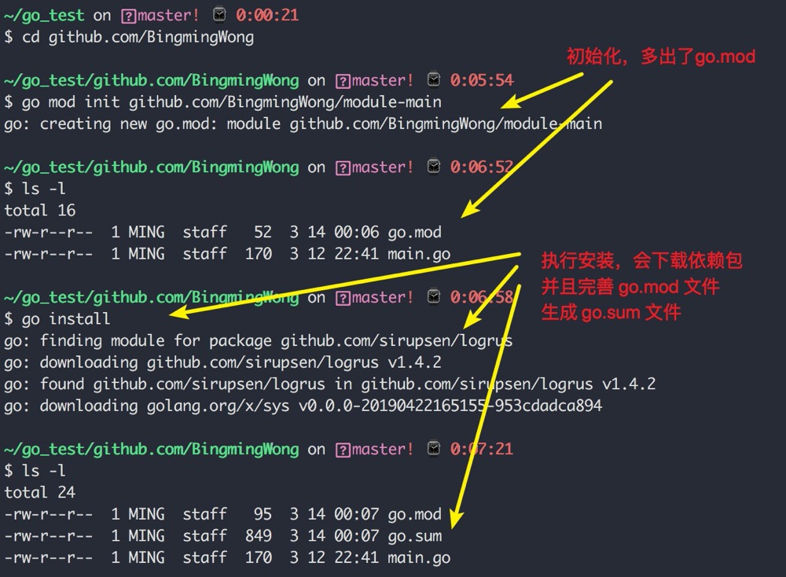

1. go modules 在 v1.11 版本正式推出，在最新发布的 v1.14 版本中，官方正式发话，称其已经足够成熟，可以应用于生产上。

        2021.2.7 号，go 最新版本 ➜  
        ~ go version
        go version go1.15.4 darwin/amd64

2. 从 v1.11 开始，go env 多了个环境变量： GO111MODULE ，这里的 111，其实就是 v1.11 的象征标志

    GO111MODULE 是一个开关，通过它可以开启或关闭 go mod 模式。

    它有三个可选值：off、on、auto，默认值是auto。

+ GO111MODULE=off禁用模块支持，编译时会从GOPATH和vendor文件夹中查找包。

+ GO111MODULE=on启用模块支持，编译时会忽略GOPATH和vendor文件夹，只根据 go.mod下载依赖。

+ GO111MODULE=auto，当项目在$GOPATH/src外且项目根目录有go.mod文件时，自动开启模块支持。

   go mod 出现后， GOPATH（肯定没人使用了） 和 GOVENDOR 将会且正在被逐步淘汰，但是若你的项目仍然要使用那些即将过时的包依赖管理方案，请注意将 GO111MODULE 置为 off。

   具体怎么设置呢？可以使用 go env 的命令，如我要开启 go mod ，就使用这条命令

        $ go env -w GO111MODULE="on"

3. go module 使用

   go mod 不再依靠 $GOPATH，使得它可以脱离 GOPATH 来创建项目，于是我们在家目录下创建一个 go_test 的目录，用来创建我的项目，详细操作如下：

   

   接下来，进入项目目录，执行如下命令进行 go modules 的初始化

        go mod init github.com/username/projectName

   

   接下来很重要的一点，我们要看看 go install 把下载的包安装到哪里了？

   

   上面我们观察到，在使用 go modules 模式后，项目目录下会多生成两个文件也就是 go.mod 和 go.sum 

   

4. go mod 命令

+ go mod init：初始化go mod， 生成go.mod文件，后可接参数指定 module 名，上面已经演示过。

+ go mod download：手动触发下载依赖包到本地cache（默认为$GOPATH/pkg/mod目录）

+ go mod tidy ：添加缺少的包，且删除无用的包

+ go mod verify ：校验模块是否被篡改过

5. 导入第三方包

    如何给项目添加依赖（写进 go.mod）呢？

    有两种方法：

    + 你只要在项目中有 import，然后 go build 就会 go module 就会自动下载并添加。
    
    + 自己手工使用 go get 下载安装后，会自动写入 go.mod 。