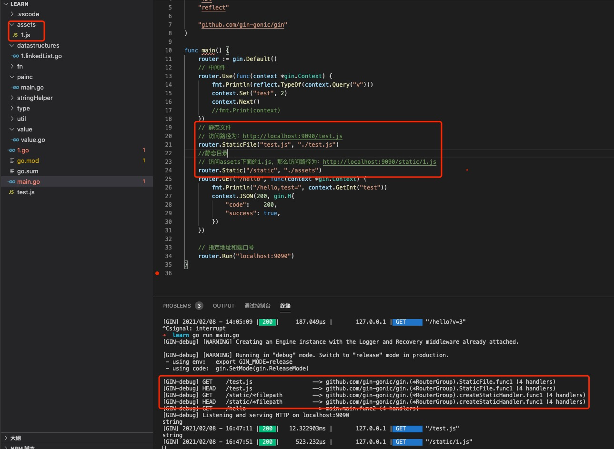

1. 创建Engine实例,使用new 或 default 初始化，返回实例的指针

    new 和 default 的不同，new 使用默认初始化，default 使用的也是new, 但是添加了logger 和 recovery 两个中间件
   
        import (
            "github.com/gin-gonic/gin"
        )

        func main(){
            engine:=gin.Default()
        }

2. 加载中间件，使用use

        func main(){
            engine:=gin.Default()
            // 中间件是一个函数接受context 指针作为参数
            engine.use(func(context *gin.Context){
                //    
                c.Next()
            })
        }

   > 中间件是一个函数，接受一个context 指针作为参数

        // 定义中间, 这种方法可以传递参数到中间件中
        func MiddleWare() gin.HandlerFunc {
            return func(c *gin.Context) {
                t := time.Now()
                fmt.Println("中间件开始执行了")
                // 设置变量到Context的key中，可以通过Get()取
                c.Set("request", "中间件")
                // 执行函数
                c.Next()
                // 中间件执行完后续的一些事情
                status := c.Writer.Status()
                fmt.Println("中间件执行完毕", status)
                t2 := time.Since(t)
                fmt.Println("time:", t2)
            }
        }

        // 全局注册，会作用于每一个http请求
        engine.use(MiddleWare())

3. 静态资源配置

+ 静态文件配置，配置当个静态文件

        engine.StaticFile(favicon.ico,"./assets/favicon.ico")

+ 静态目录设置

        engine.Static("/static","/var/www")

   

4. 路由配置 

   context 提供了多种http 协议，比如get,post,put,delete 等简单方法设置路由

        engine.post(path,middleware,func(c *gin.Context){

        })
        //path 路径
        router.GET("/user/:name", func(c *gin.Context) {
            name := c.Param("name")
            c.String(http.StatusOK, "Hello %s", name)
        })

    路由组， 在gin 框架中提供了路由组，在路由组中的路由都加上路由组中的路径

        someGroup := router.Group("/someGroup")
        {
            someGroup.GET("/someGet", getting)
            someGroup.POST("/somePost", posting)
        }

        路由组添加中间件

        // 认证路由组
        // authorized := r.Group("/", AuthRequired())
        // 和使用以下两行代码的效果完全一样:
        authorized := r.Group("/")
        // 路由组中间件! 在此例中，我们在 "authorized" 路由组中使用自定义创建的 
        // AuthRequired() 中间件
        authorized.Use(AuthRequired())
        {
            authorized.POST("/login", loginEndpoint)
            authorized.POST("/submit", submitEndpoint)
            authorized.POST("/read", readEndpoint)
            // 嵌套路由组
            testing := authorized.Group("testing")
            testing.GET("/analytics", analyticsEndpoint)
        }

    
5. 路由参数

   路由参数分为三类和文件，query,body,path

+ query: 参数放在url ？后面，多个使用& 相连

   + context.Query(key) string ：获取参数，返回字符串，不存在返回空字符串

   + context.DefaultQuery(key,defaultValue string) string: 自己设置默认返回值

   + context.QueryArray(key) []string: 返回切片

+ body: http body 请求

   body 是表单提交，post,put body 提交

   + PostForm(key) string: 返回字符串，默认为空值

   + DefaultPostForm(key,defaultValue string): 自己设置默认值

   + PostFormArray(key string) []string: 返回切片

+ params: path 路由参数

+ 文件上传： 

   + 单文件上传

        // 为 multipart forms 设置较低的内存限制 (默认是 32 MiB)
        // router.MaxMultipartMemory = 8 << 20  // 8 MiB
        router.POST("/upload", func(c *gin.Context) {
            // 单文件
            file, _ := c.FormFile("file")
            log.Println(file.Filename)
            // 上传文件至指定目录
            // c.SaveUploadedFile(file, dst)
            c.String(http.StatusOK, fmt.Sprintf("'%s' uploaded!", file.Filename))
        })

        context.FormFile(name string)

   + 多文件上传

         // 为 multipart forms 设置较低的内存限制 (默认是 32 MiB)
        // router.MaxMultipartMemory = 8 << 20  // 8 MiB
        router.POST("/upload", func(c *gin.Context) {
            // Multipart form
            form, _ := c.MultipartForm()
            files := form.File["upload[]"]
            for _, file := range files {
                log.Println(file.Filename)
                // 上传文件至指定目录
                // c.SaveUploadedFile(file, dst)
            }
            c.String(http.StatusOK, fmt.Sprintf("%d files uploaded!", len(files)))
        })
        router.Run(":8080")
        context.MultipartForm() 

6. 响应

+ 字符串回应

        c.String(code int, "some string")

+ json 响应

        // code http 状态码
        c.JSON(code int,obj interface{}){

        }

+ JSONP 响应

+ xml 响应

+ Redirect: 直接跳转

        Redirect(code int, location string) 

+ File: 返回一个文件

+ FileAttachment： 文件下载

        func (c *Context) FileAttachment(filepath, filename string) {
            c.Writer.Header().Set("content-disposition", fmt.Sprintf("attachment; filename=\"%s\"", filename))
            http.ServeFile(c.Writer, c.Request, filepath)
        }
+ Stream： 字节流

+ HTML

+ Data 返回一个二进制数据

         Data(code int, contentType string, data []byte)

+ DataFromReader：

        router.GET("/someDataFromReader", func(c *gin.Context) {
            // http.Get 获取数据
            response, err := http.Get("https://raw.githubusercontent.com/gin-gonic/logo/master/color.png")
            if err != nil || response.StatusCode != http.StatusOK {
                c.Status(http.StatusServiceUnavailable)
                return
            }
            reader := response.Body
            contentLength := response.ContentLength
            contentType := response.Header.Get("Content-Type")
            extraHeaders := map[string]string{
                "Content-Disposition": `attachment; filename="gopher.png"`,
            }
            c.DataFromReader(http.StatusOK, contentLength, contentType, reader, extraHeaders)
        })

7. 启动，指定端口号，默认为8080

        router.Run("localhost:9090") // 默认为host:port, 如果为空
        // https
         r.RunTLS(":8080", "./testdata/server.pem", "./testdata/server.key")