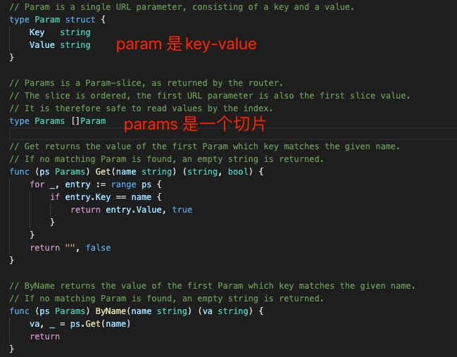

1. 有三种类型的参数和文件传递

+ query: query 是获取url ？(问号)后面的参数

+ post : 获取post 中body 中的参数，通常就是form 表单中的数据

+ path: 路径中的参数，类似/user/:id 这样的参数

+ 文件： 单文件和多文件上传

+ 特殊类型的参数--数组

2. path 路径参数在gin 中使用params 获取参数

        type Context struct {
            writermem responseWriter
            Request   *http.Request
            Writer    ResponseWriter

            Params   Params // 参数对象

            。。。
        }

   

