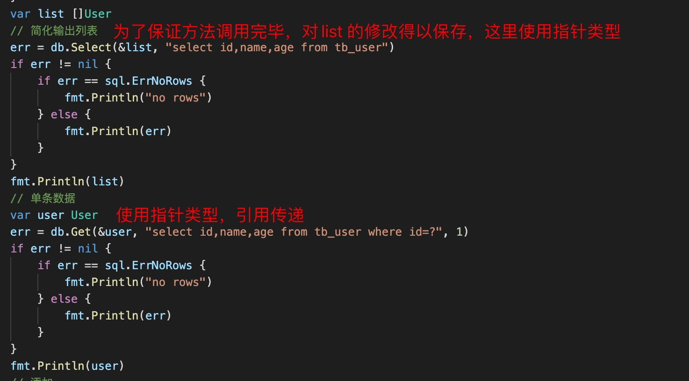
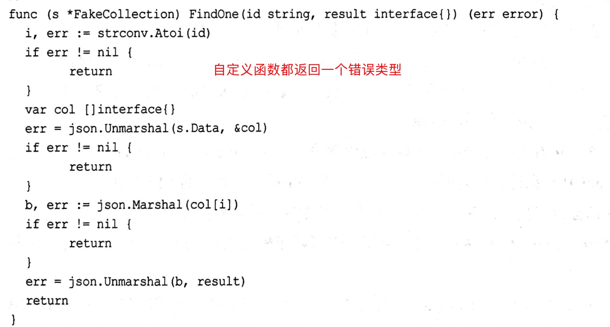

1. 获取环境变量

   使用os.Getenv 获取环境变量

        os.Getenv("port")

2. 在go 语言中很多函数接受一个参数，给这个参数赋值，此时要传递地址，因此才能保证在函数中的修改在函数调用完以后使传入的参数保留函数中的修改，比如

    
    
    在比如mysql 中的方法

    

3. 在go 语言中定义方法处理error 错误

   