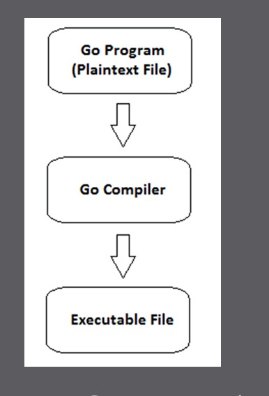
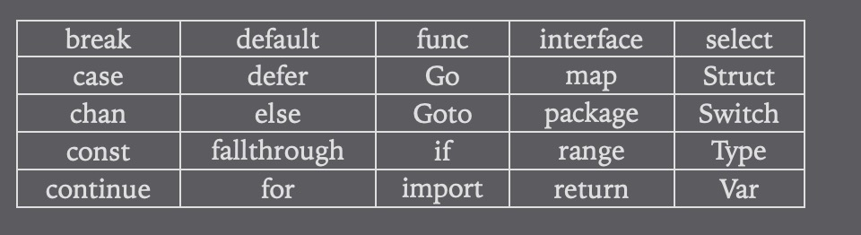
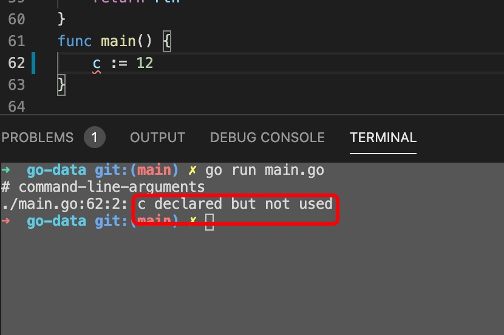

1. go 文件后缀名为.go

2. go 是编译型语言，需要经过编译才能执行

   

3. 注释

  + 单行注释  //

  + 多行注释  /**/

4. go 语言中只有25个关键字

   

5. go 是通过类库来管理源代码的，go 可以创建类库和单独运行的二进制文件，如果是单独运行的二进制文件，必须有一个main 包，在main 中有一个入口函数main 方法

        package main

        func main(){

        }

6. go 和其他语言最大的区别就是go 语言中引用了包或声明了局部变量则必须使用，不然会报错

   