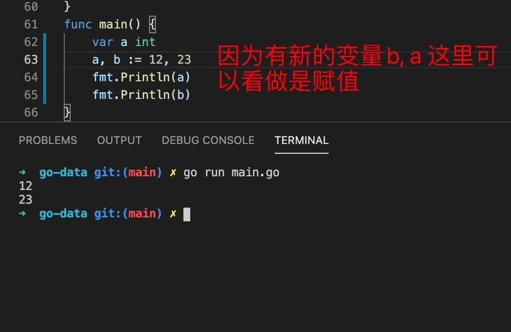
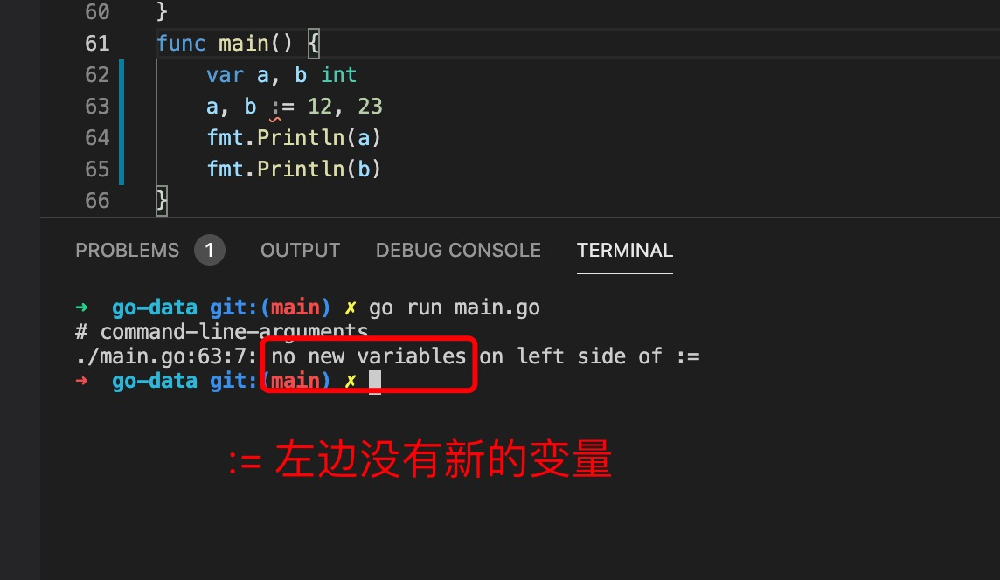
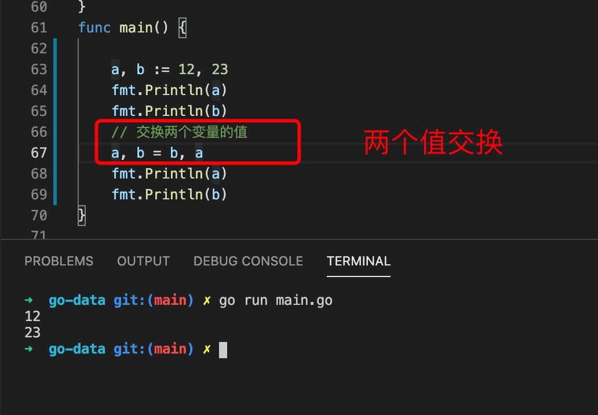

1. 变量定义

        // 变量声明和其他语言不一样，变量类型在变量名后面
        var name type

        或者使用类型推断
        // 省略变量类型
        var name="hello" 

        // 声明多个

        var a,b int 
        ===>
        var a int
        var b int

2. var name type 这种类型声明会自动复制类型的默认值

+ bool: 默认值false

+ string: 默认值 ""

+ int: 0

+ float64: 0

3. 多个变量

        var a,b string

        a,b=1,2

        // 等同于
        a=1
        b=2

        参数

        func test(a,b string){

        }

4. 简短变量声明

   简短变量声明只用于函数内部

        a:=12 // 类型推断

        a,b=12,23

   简短声明变量如果左边没有新的变量会报错，有新的变量可以重新声明

   
   

5. 交换值

   变量的声明可以同时声明多个

            a,b:=12,23
            
            Debug, LogLevel, startUpTime := false, "info", time.Now()
    
    利用这个特性可以和容易实现两个变量的值交换
    
    

6. 在go 语言中变量声明了必须使用，不然会报错，这是与其他语言最大的不同

   

7. 下划线在go 语言中表示忽略该变量，由于go 语言中有很多返回多个参数的方法，有时候我们不需要其中的一个，就可以使用下划线变量，忽略返回的值

        var b string="hello"

        for _,value :=range b{
            // 循环字符串时，返回index,value ，这里我们用不到index ，而 range b 又返回两个值，可以使用_ 忽略index 的值
        }

8. 声明多个不同类型的变量

         var (
            a int =0
            b bool=false
            c string="hello"
         )