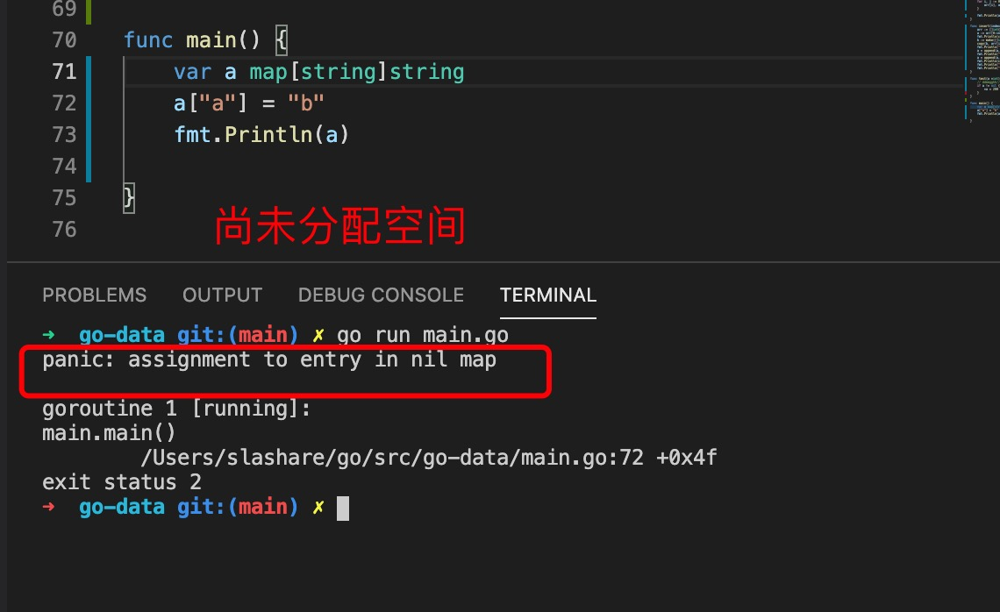
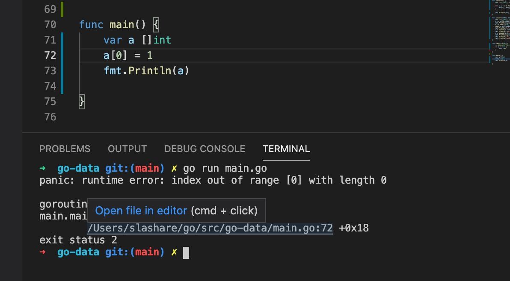
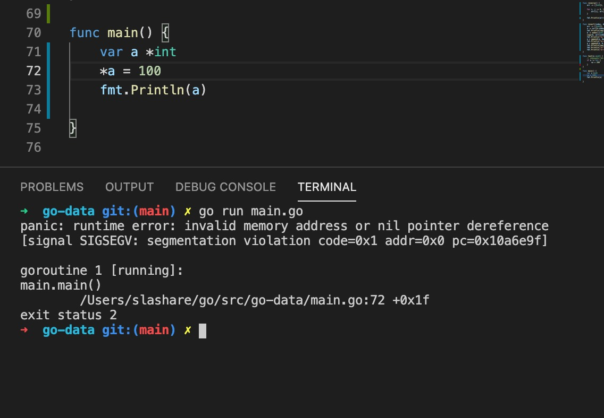

1. 基础数据类型： 数字，字符串，字符(byte,rune),bool 类型，struct,

2. 集合类型： array,slice,map 都是key-value 形式的集合，array 和 slice 以索引作为key 

3. 在go 语言中slice,map,指针，chan(channel) 都是引用类型，使用var type 声明的变量都是未分配空间的，不能直接用索引赋值，比如

    
    
    