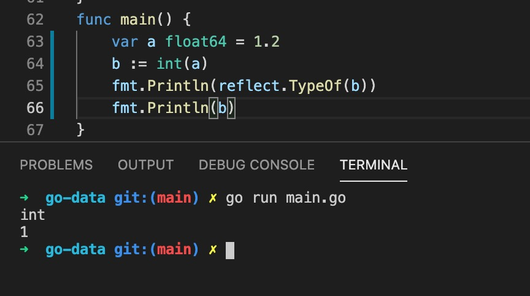

1. 在go 语言中数字类型分为两类 ，整形和浮点型

> 整形

整形有分为有符号(即有正负之分)类型和无符号(全是正整数)类型

+ 有符号为

int8 int16 int32 int64 int(根据操作系统决定是32位还是64位)

uint8 uint16 uint32 uint64 uint(根据操作系统决定是32位还是64位)

> 浮点型

在go语言中浮点类型只有两类 float32 和 float64 ,

2. 整形和浮点数最大值在math 库中

        import (
            "math"
        )
        fmt.Println(math.MaxInt64)
        //9223372036854775807
    
    

3. 特殊类型 

+ uintptr： 指针类型

+ byte: 实际上是uint8

   

+ rune: 

   

4. 同类型之间可以强制转换

    Type(a)

    

5. 整数的遍历

    个位数是百位数相差10倍，百位数和千位数相差10倍，依次类推，因此要遍历整数，可以一步一步的除以10

    

