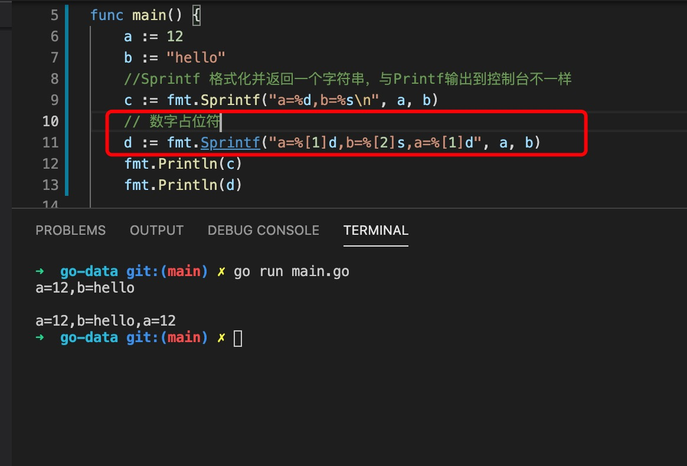
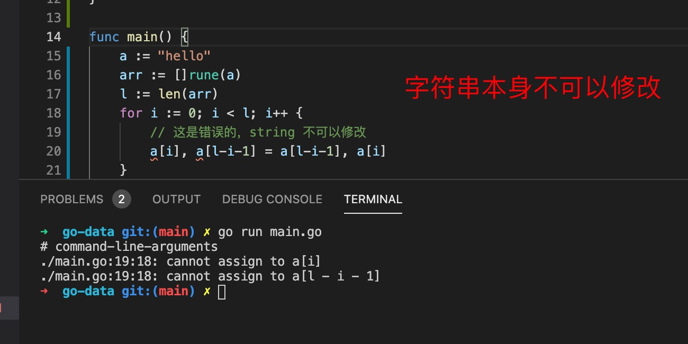
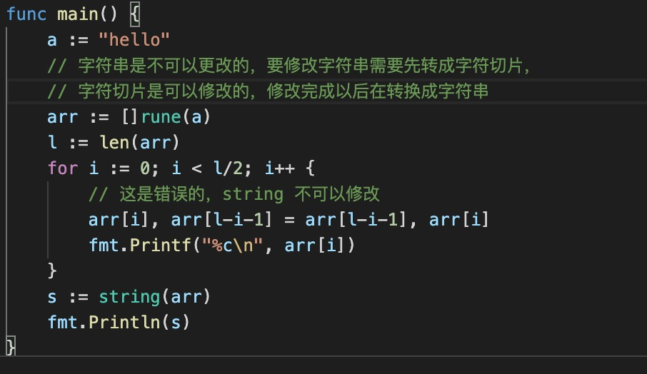

1. 在go语言中字符串使用双引号("")或反引号(``)括起来, 反引号可以字符串换行

   > 在go语言中单引号表示的是字符

2. 字符串可以看出特殊的字符切片，[]byte 或者[]rune 类型

   

3. len 返回字符串的字节数量，中文占三个字节

   

4. 字符串的操作

   在strings库中，包括Trim,Split等

5. 字符串格式化操作

   fmt.Sprintf() 格式化字符串，返回一个字符串

   
   

6. 字符串拼接

+ 使用+ 号

+ 使用Sprintf()

7. 字符串不可以修改，如果要修改则要先转成字符切片，然后在修改里面的内容

   
   比如：反转字符串

   

