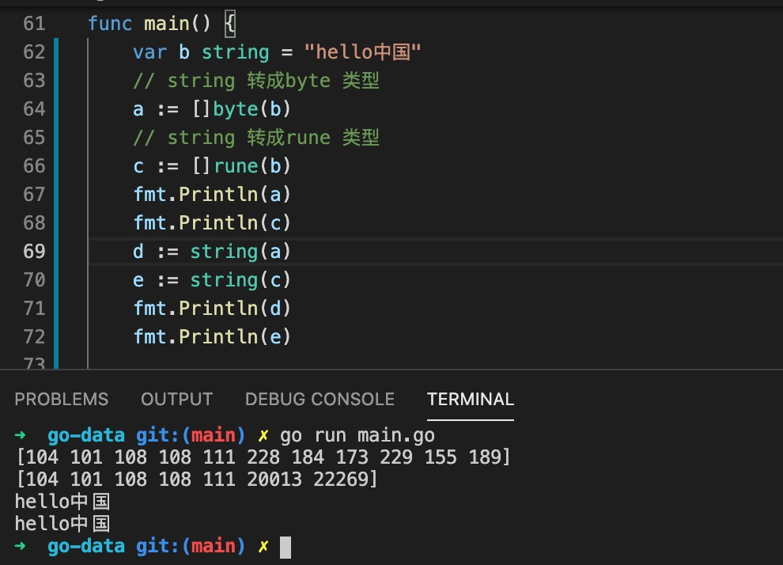
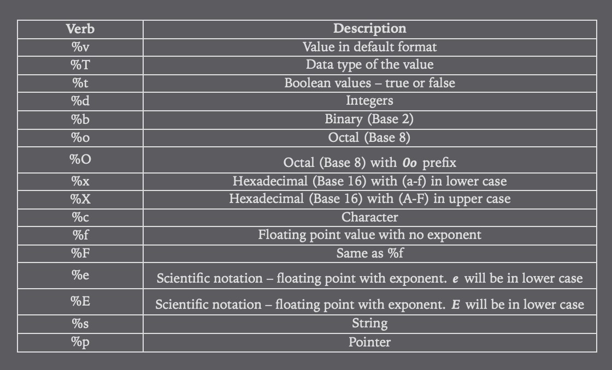
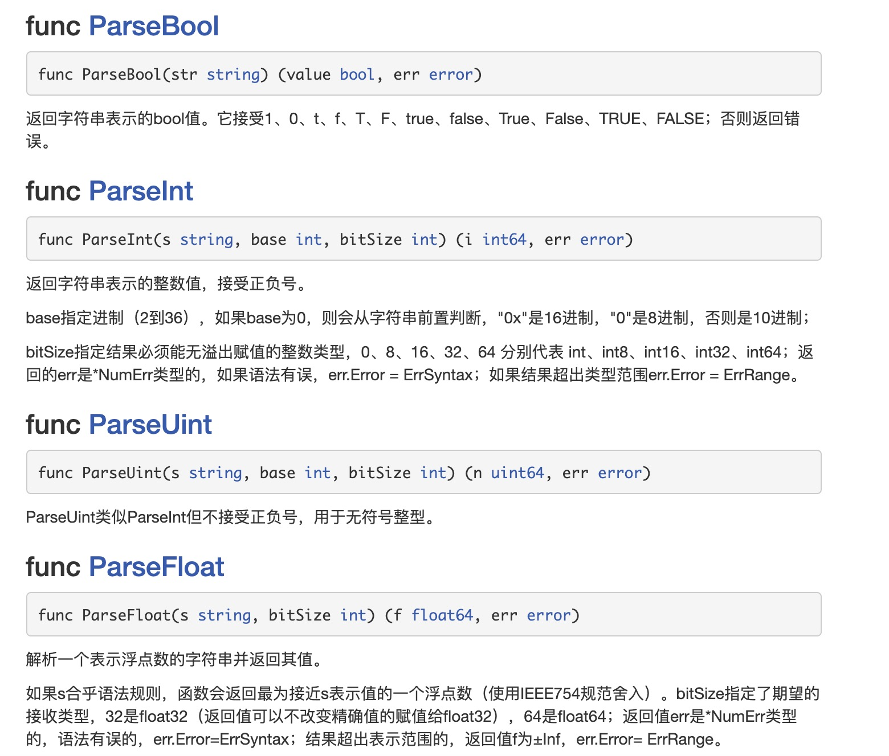
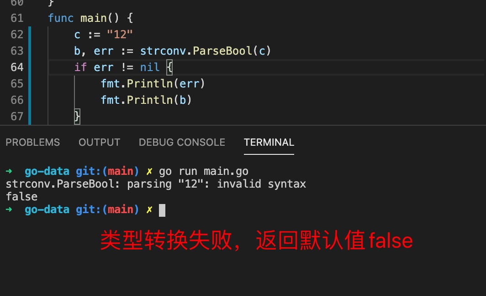
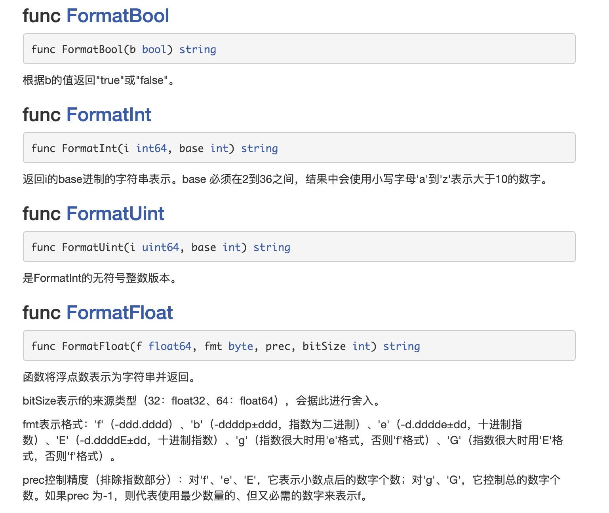
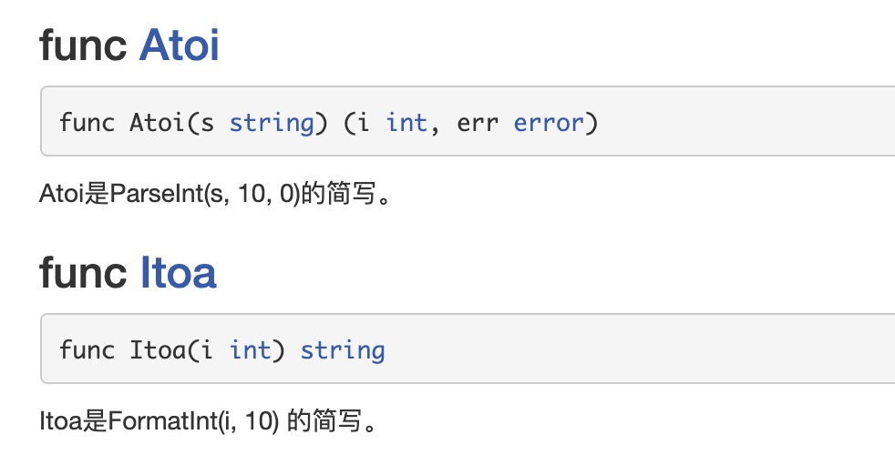

1. 字符串可以看出特殊的字符切片，因此可以和字符切片强制转换，字符切片分为byte 和 rune 类型

   

2. 不同类型之间的转换

   不同类型之间的转换不能使用强类型转换，

   > 其他基础类型转字符串，比如 数字，bool 类型 ，可以使用format

   fmt.Sprintf(string,interface{}) string

      

   > 使用strconv 库，strconv 库中包含了string 转其他类型ParseXXX, 和其他类型转字符串类型 FormatXXX

   + 字符串转其他类型

      

      返回值有两个，多了一个error 这是因为字符串转为其他类型时可能失败，比如ParseBool 转成bool 类型，bool 类型的值只有两个true 和 false, 那么其他字符串转成bool 都可能是错误的， 在比如hello 转成int 类型，一定是错误的，

      ***如果类型转换失败，会返回类型的默认值，同时返回error***

      

   + 其他类型转字符串

      

   + int 类型和string 类型方法使用itoa 和atoi

      

