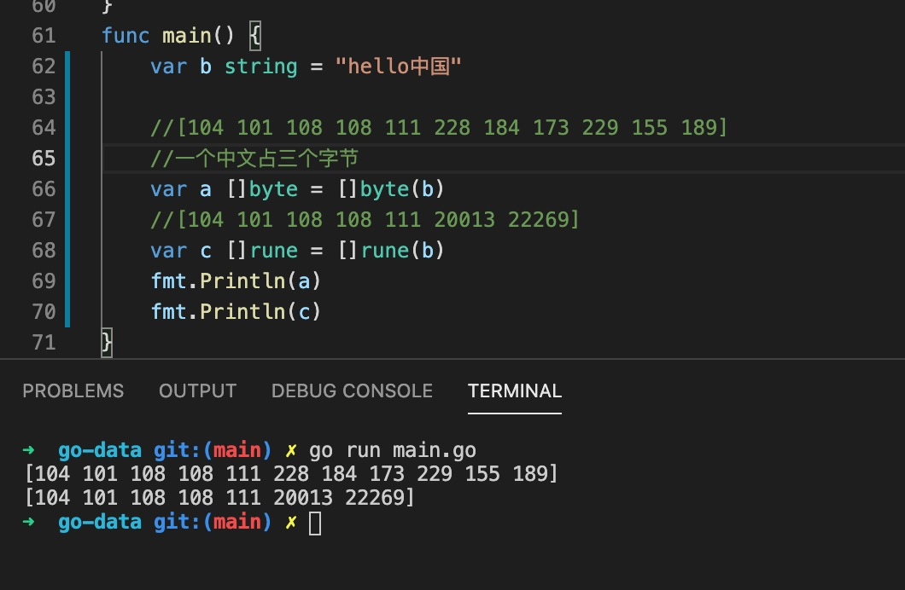
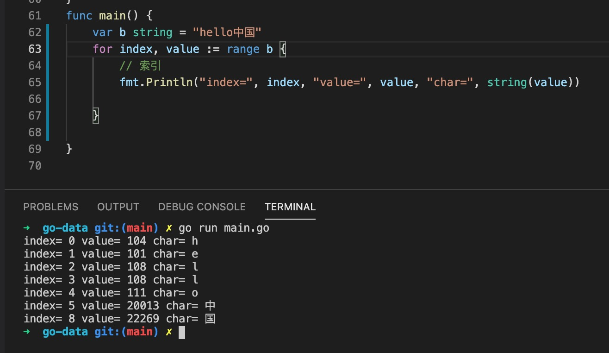

1. 在go 语言中有字符串和字符区分，字符使用单引号括起来

        var a ='c' // 返回的是assii 码值

2. go 语言中有两种类型的字符

+ byte: 返回assii 码值，一个中文占三个字节

+ rune: 可以处理特殊字符，包括中文，日文，一个中文占一个字符

3. 字符返回的是assii 码值，如果想返回字符，需要经过string 转换，字符串可以看出字符的切片，因此字符可以和字符串互转

   

   