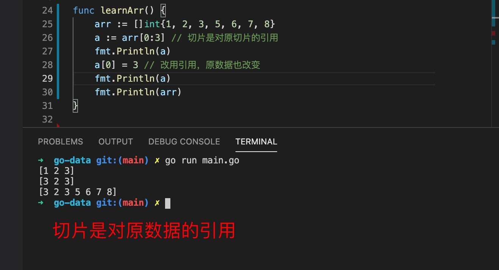

1. 切片和数组差不多，可以把切片看成动态数组，切片的长度是可以增加的

2. 切片是引用类型，底层使用的是数组

3. 切片声明定义和数组差不多

        var arr []int // [] 这里面没有长度

4. 返回切片的长度

        len(arr)

5. 给切片添加元素，使用append 在切片后面添加元素

        arr = append(arr,2)

6. 切片在切片，切片是对原数据的引用，更改新切片中的元素，原切片数据也跟着改变

   

   

7. copy 全局函数复制

   + copy 不会新建新的内存空间，由它原来的切片长度决定

   

   + copy 拷贝必须是相同的类型

   

   + copy(dest,src) ： dest 如果长度小于src, 那么src 中多余的部分则丢失

   
   
   

8. 排序

+ 自定义排序，比如冒泡排序，插入排序等

+ 使用sort 库

   + int 类型的切片使用sort.Ints(a []int)

                arr := []int{5, 3, 7, 2, 1, 4, 6}

                sort.Ints(arr)//[1 2 3 4 5 6 7]

                fmt.Println(arr)

   + string 类型的切片使用sort.Strings(a []string)

                arr1 := []string{"a", "c", "f", "b", "d"}
                sort.Strings(arr1)//[a b c d f]
                fmt.Println(arr1)

9. 删除元素，切片中没有提供删除切片元素的方法，可以使用切片

   

10. reverse 翻转转切片

   

11. 在其他位置插入元素

   