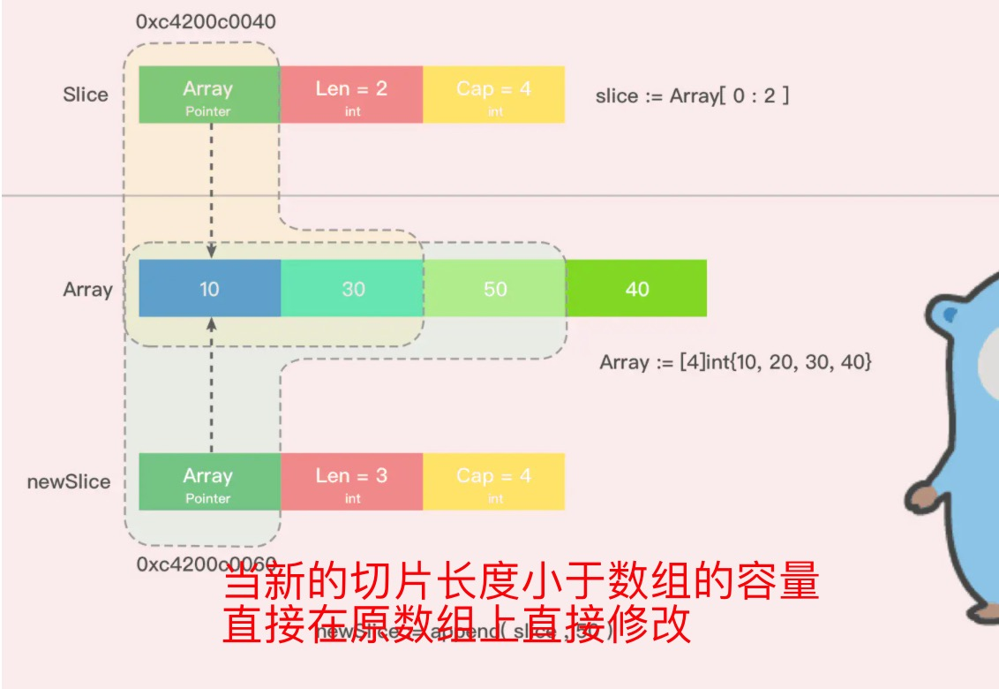
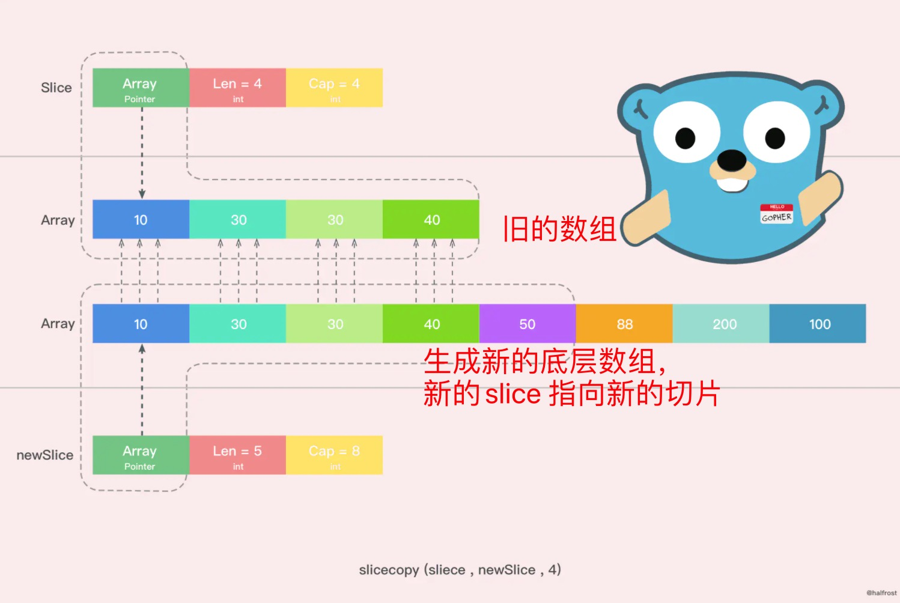
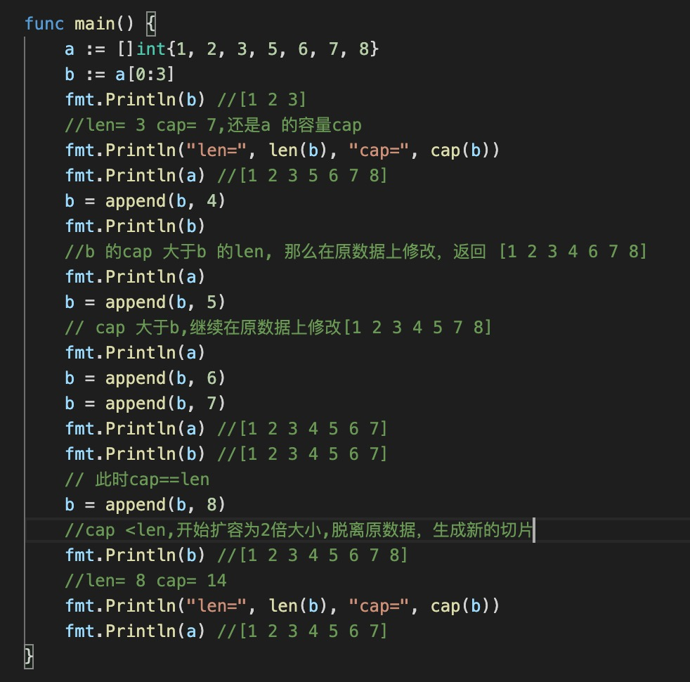

1. 在弄清切片原理之前，先理解len 和 cap(容量)

    len 返回切片中元素的实际个数，cap 当前切片最大的容量

    比如一个切片容量为10，但是实际上只存储了7个元素，那么len==7,cap(arr)==10

2. 切片的原理是有一个指针指向底层的数组，数组长度是固定的（可以看成切片的容量），当切片长度逐渐大于cap 时，底层的数组不够长度，这时候就需要扩容，默认开始为cap*2 （即以两倍的形式开始扩展）

> 切片是原数据的引用，切片中修改了数据对应原数据也会修改，有时候这种会造成数据的错误

   切片扩容形式

   + 当切片的长度小于原数据的长度时，新数据会在原数据上修改

      

   + 当切片的长度大于原数据的cap 时，会生成新的切片，因为之前的底层数组不能满足之前的，因此生成新的扩增两倍的底层数组，切片指向新的数组，此时切片和旧数据完全脱离，在修改不会影响以前的数据

      
      