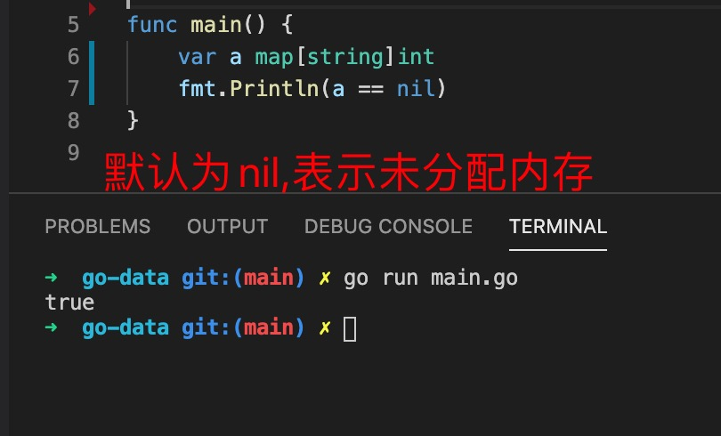

1. go 语言中使用map 表示字典类型

        map[keyType]valueType

        例如： 

        var a map[string]int // 表示key 必须是string类型，值必须是int 类型

   map 是引用类型，默认为nil, 表示只是声明了变量，并未分配内存空间

   

2. map 定义了key 的类型和value 类型，因此在赋值时必须保证key 和 value 的类型必须保证和定义时的类型一致

   

3. map 初始化

   

   

    上面例子中的 mapCreated a := make(map[string]int)。

    相当于：a := map[string]int{}。

    map 初始化完成以后就可以做其他操作了

4. map 通过[key] 的形式访问元素，设置元素，如果key 已存在，则更改key 的值，key 不存在则新增key ，并设置值

   

5. 通过key 获取值

   

6. 使用delete(map,key) 内置函数删除map 中的key

   

7. 字典的遍历循环

   

8. len 返回字典中key 的个数