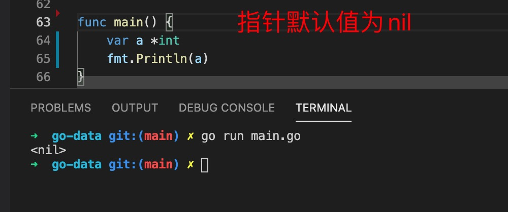
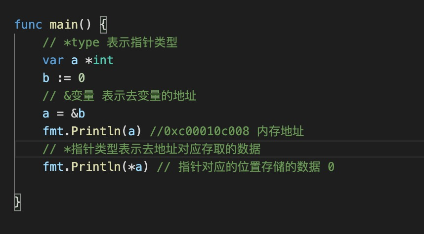
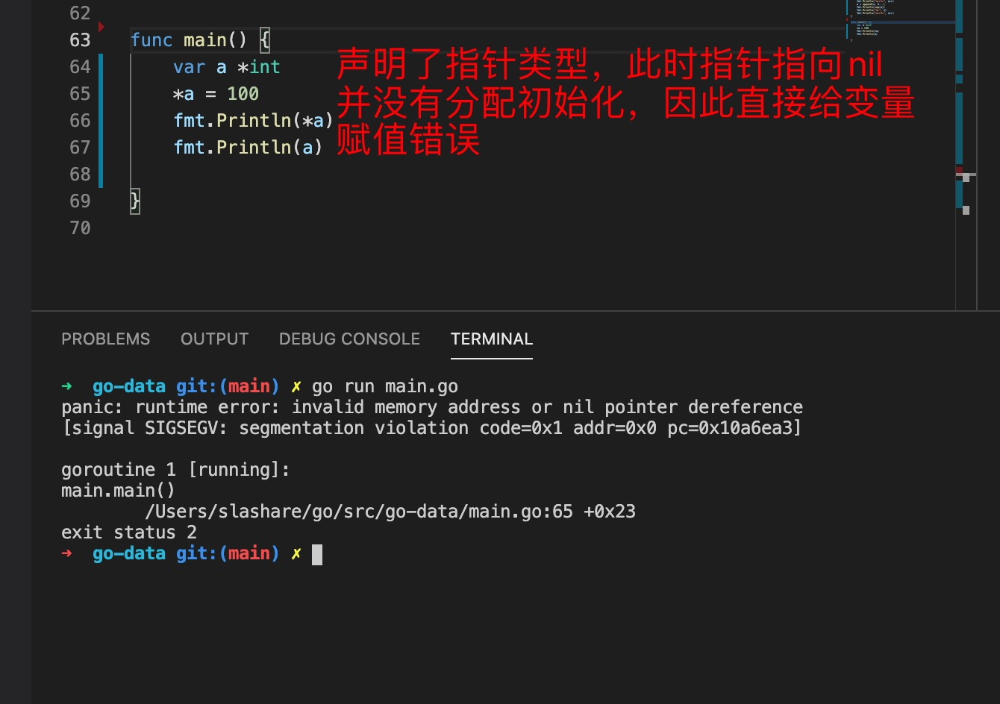
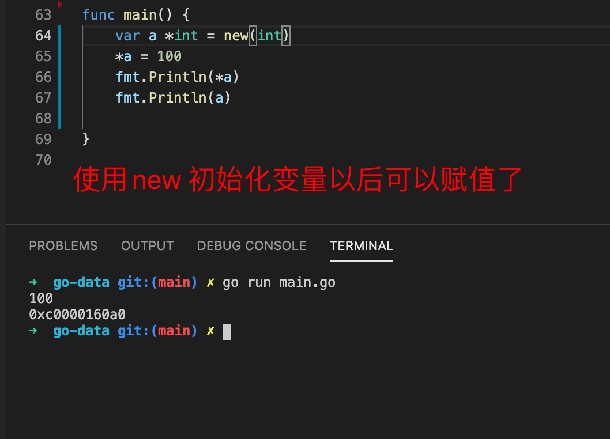
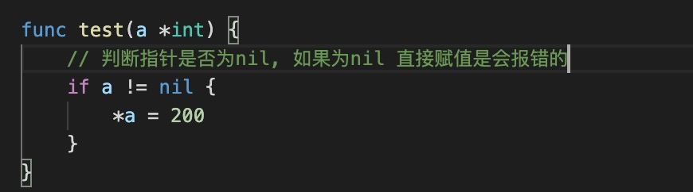

1. go 语言中指针表示变量存储在内存的地址

        var ptr *type // *type(表示指针类型)

        new 创建指针类型

        var ptr=new(type)

2. 指针实例和默认值

    
    

    var a *int只是声明了一个指针变量a但是没有初始化（为nil），指针作为引用类型需要初始化后才会拥有内存空间，才可以给它赋值。
    
    使用new(type) 初始化变量
    

3. 从上面的例子可以看出当指针为nil 时，给变量赋值会报错，导致应用程序停止，因此在对指针进行操作时，先判断指针是否为nil 是最好的实战

    

4. 指针类型返回的变量在内存的地址，比如：

        var a *int = new(int)
	    fmt.Println(a)// a =0xc0000160a0

    当一个变量指向另一个变量的地址时

        b := 12
        a := &b //&b &变量名表示取该变量的地址
        fmt.Println(a)
    
    获取指针指向地址的数据或者给数据赋值或者修改数据

        func main() {
            b := 12
            a := &b        //&b &变量名表示取该变量的地址
            fmt.Println(a) //0xc0000160a0
            *a = 100       // *指针变量：可以看做是解指针，获取指针对应的数据
            *a += 12
            fmt.Println(a)  //0xc0000160a0
            fmt.Println(*a) //112

        }