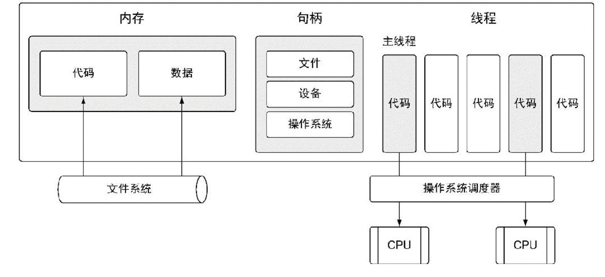

1. csp

   go 语言的并发同步模型来自一个叫作通信顺序进程(Communicating Sequential Processes CSP)的泛型(paradigm)

   CSP 是一种消息传递模型，通过在goroutine 之间传递数据来传递消息，而不是对数据进行加锁来实现来实现同步访问

   用于goroutine 之间同步和传递数据的关键数据类型叫作通道(channel)

2. 进程和线程

+ 进程

   当运行一个应用程序(如一个IDE或者编辑器)的时候，操作系统会为这个应用程序启动一个进程，可以将这个进程看做一个包含了应用程序在运行中需要用到和维护的各种资源的容器

+ 线程

  一个进程可以有一个或多个线程，***每个进程的初始线程被称作主线程***

  执行主线程的空间时应用程序的本身的空间，所以当主线程终止时，应用程序也会终止。

  