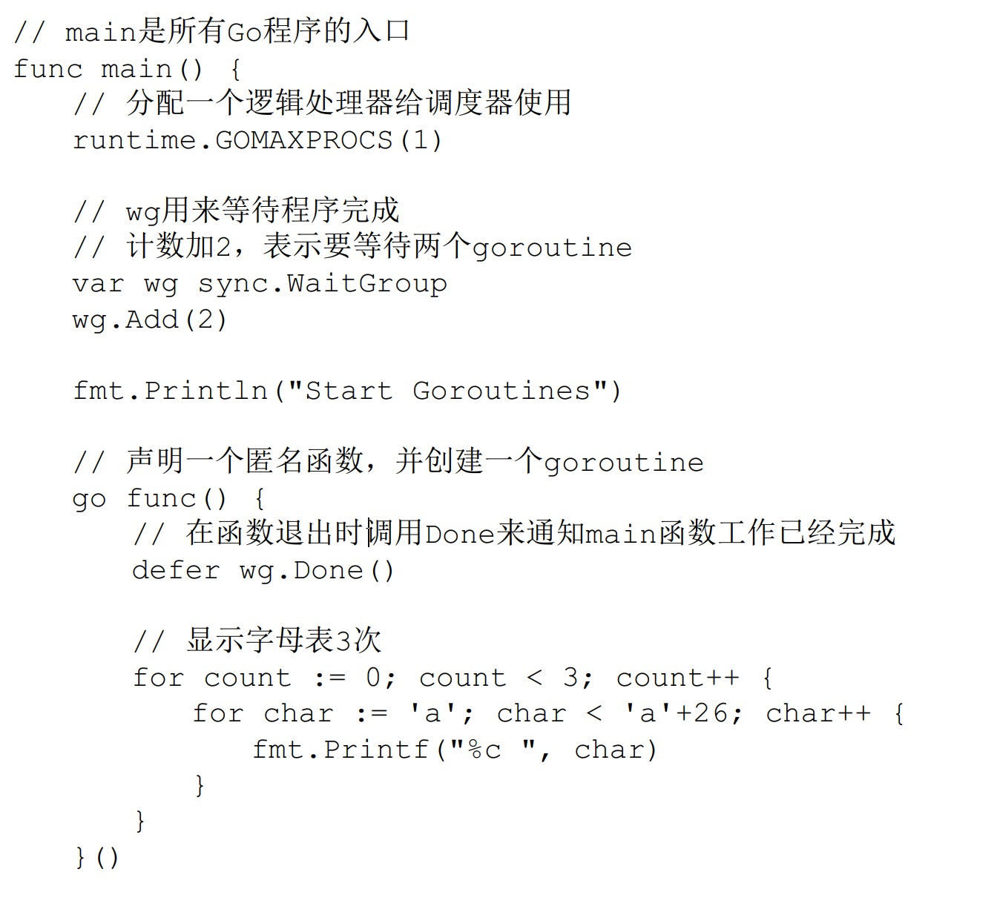
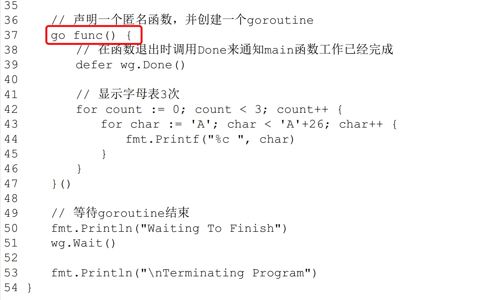

1. go 使用goroutine 实现并发

   goroutine的概念类似于线程，但 goroutine是由Go的运行时（runtime）调度和管理的。Go程序会智能地将 goroutine 中的任务合理地分配给每个CPU

   Go语言中使用goroutine非常简单，只需要在调用函数的时候在前面加上go关键字，就可以为一个函数创建一个goroutine。

   ***一个goroutine必定对应一个函数，可以创建多个goroutine去执行相同的函数***

   >在程序启动时，Go程序就会为main()函数创建一个默认的goroutine。当main()函数返回的时候该goroutine就结束了，所有在main()函数中启动的goroutine会一同结束

2. goruntine 调度

   GPM是Go语言运行时（runtime）层面的实现，是go语言自己实现的一套调度系统。区别于操作系统调度OS线程。

    1.G很好理解，就是个goroutine的，里面除了存放本goroutine信息外 还有与所在P的绑定等信息。

    2.P管理着一组goroutine队列，P里面会存储当前goroutine运行的上下文环境（函数指针，堆栈地址及地址边界），P会对自己管理的goroutine队列做一些调度（比如把占用CPU时间较长的goroutine暂停、运行后续的goroutine等等）当自己的队列消费完了就去全局队列里取，如果全局队列里也消费完了会去其他P的队列里抢任务。

    3.M（machine）是Go运行时（runtime）对操作系统内核线程的虚拟， M与内核线程一般是一一映射的关系， 一个groutine最终是要放到M上执行的；

    P与M一般也是一一对应的。他们关系是： P管理着一组G挂载在M上运行。当一个G长久阻塞在一个M上时，runtime会新建一个M，阻塞G所在的P会把其他的G 挂载在新建的M上。当旧的G阻塞完成或者认为其已经死掉时 回收旧的M。

    P的个数是通过runtime.GOMAXPROCS设定（最大256），Go1.5版本之后默认为物理线程数。 在并发量大的时候会增加一些P和M，但不会太多，切换太频繁的话得不偿失

2. 创建goruntine 在函数前面加一个go 关键字即可

   
   