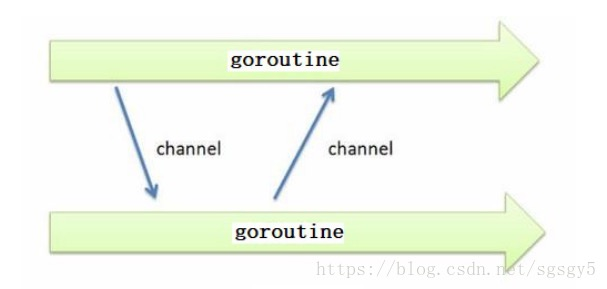

1.channel 

   
   使用 channel 在多个 goroutine 中传递数据

   channel 传递数据是由类型的，一个channel 只能传递一种类型的值，比如：如果数据类型定义为int 类型，那么这个通道只能传递int 类型的值。

   ***一个channel 同时仅允许被一个goroutine 读写。***

   和map类似，channel也一个对应make创建的底层数据结构的引用
   
   当我们复制一个channel或用于函数参数传递时，我们只是拷贝了一个channel引用，因此调用者和被调用者将引用同一个channel对象。和其它的引用类型一样，channel的零值也是nil。

   定义一个channel时，也需要定义发送到channel的值的类型

    channel 是引用类型，默认值为nil
    ch:=make(chan int) //这里就是创建了一个channel，这是无缓冲管道注意

2. 无缓冲和有缓冲channel

+ 无缓冲channel

   

        // 声明一个 int 类型的无缓冲 channel
        c1 := make(chan int)

+ 有缓冲channel

   

   
        // 声明一个 int 类型的有缓冲 channel，容量 cap 为 5
        c2 := make(chan int, 5)

3. 发送和接受数据

    我们可以将 channel 理解为一个 FIFO 先进先出的队列，sender 向 channel 中发送数据，receiver 从 channel 中接收数据。发送和接收使用的操作符都是 <-，它们的区别是，发送时操作符在 channel 类型变量名的右边，接收时操作符在 channel 类型变量的左边

            c := make(chan int, 2)
            // 发送数据到通道
            c <- 1
            c <- 2
            
            // 接收并赋值给变量
            x <- c
            x := <- ch // 从ch中接收值并赋值给变量x
            <-ch       // 从ch中接收值，忽略结果
   
   
   

4. 关闭通道

   

   

5. 单向通道

   > 1.chan<- int是一个只能发送的通道，可以发送但是不能接收；

    把变量的值付给通道
    

    2.<-chan int是一个只能接收的通道，可以接收但是不能发送。

    