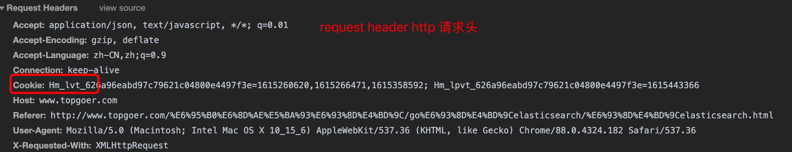
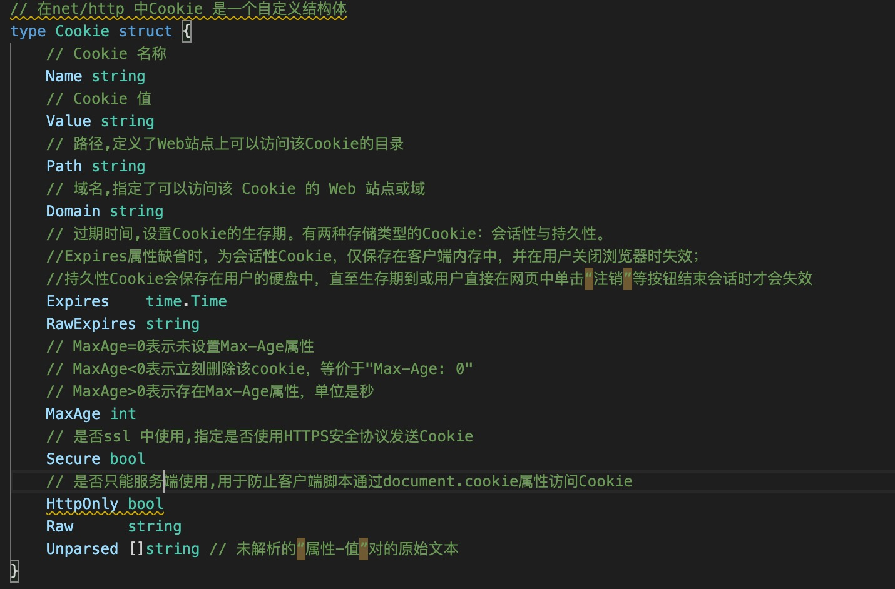
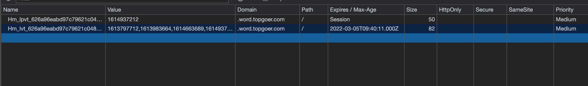
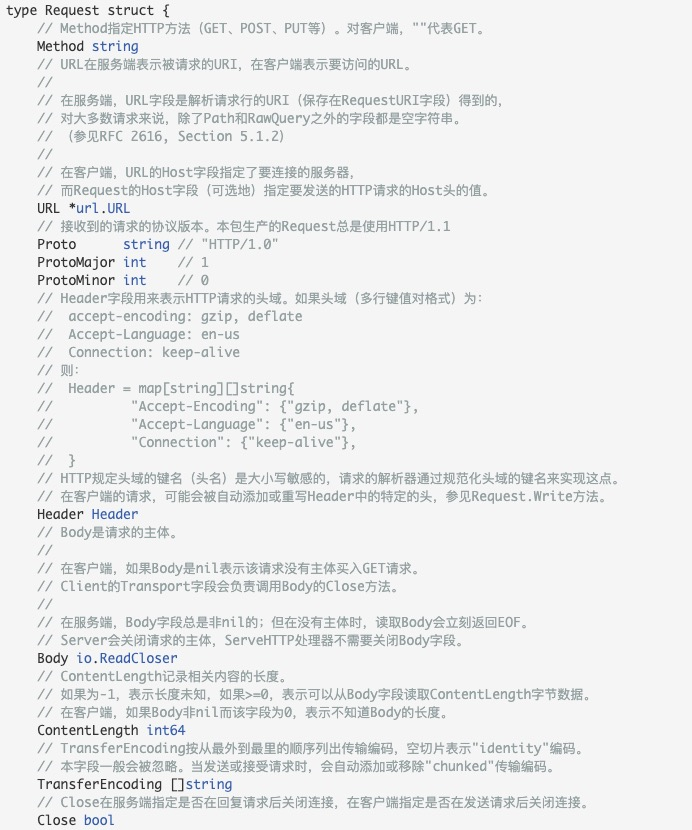
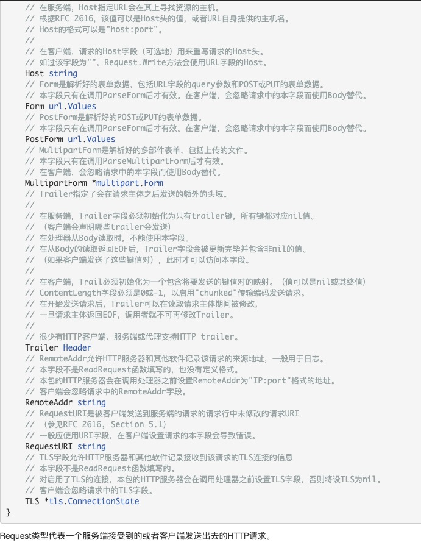

1. net/http 

   http包提供了HTTP客户端和服务端的实现。

2. net/http 提供了一些http status 常量，比如

   + http.StatusOK==200: 成功

   + http.StatusNotFound==400: 未找到

   + http.StatusInternalServerError==500 : 服务端错误

   + http.StatusUnauthorized ==401 : 验证失败

   + http.StatusForbidden==403: 禁止，没权限

2. http header 请求头

   > 定义格式

        type Header map[string][]string

        Header 是一个自定义类型，底层是map[string][]string 类型
    > header 用法

    + Get: 获取header的值

            func (h Header) Get(key string) string

            Get返回键对应的第一个值，如果键不存在会返回""。如要获取该键对应的值切片，请直接用规范格式的键访问map。

    + Set: 在header 中设置值

            func (h Header) Set(key, value string)
            Set添加键值对到h，如键已存在则会用只有新值一个元素的切片取代旧值切片。
    
    + Add: 在header 中设置值，和Set 不同的地方在于Set 会用新值替代已有的切片，而Add 是在切片中添加值

            func (h Header) Add(key, value string)
    
    + Del: 删除key

            func (h Header) Del(key string)

    http 请求头

    

3. Cookie : 

   Cookie 会随着http 请求发送到服务端

   > 定义： Cookie 是一个结构体

   

   浏览器中Cookie 展现形式
   

   > String:String返回该cookie的序列化结果。如果只设置了Name和Value字段，序列化结果可用于HTTP请求的Cookie头或者***HTTP回复的Set-Cookie头***；如果设置了其他字段，序列化结果只能用于HTTP回复的Set-Cookie头。

         func (c *Cookie) String() string

4. http 请求

   
   
