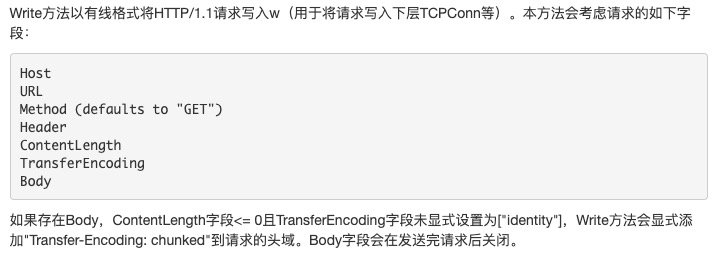
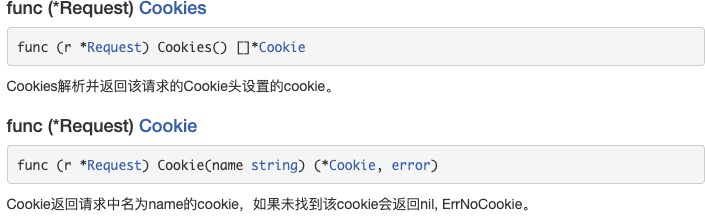
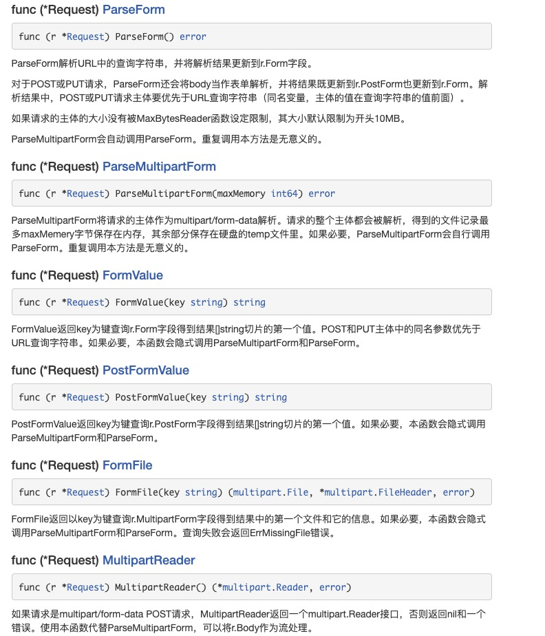

1. http Request 对象

+ 创建Request 对象指针

        func NewRequest(method, urlStr string, body io.Reader) (*Request, error)
    
    NewRequest使用指定的方法、网址和可选的主题创建并返回一个新的*Request。

    如果body参数实现了io.Closer接口，Request返回值的Body 字段会被设置为body，并会被Client类型的Do、Post和PostFOrm方法以及Transport.RoundTrip方法关闭。  

+ 获取客户端代理UserAgent

        func (r *Request) UserAgent() string
        UserAgent返回请求中的客户端用户代理信息（请求的User-Agent头）

+ Referer: 

        func (r *Request) Referer() string
   Referer返回请求中的访问来路信息。（请求的Referer头）

   Referer在请求中就是拼错了的，这是HTTP早期就有的错误。该值也可以从用Header["Referer"]获取； 让获取Referer字段变成方法的好处是，编译器可以诊断使用正确单词拼法的req.Referrer()的程序，但却不能诊断使用Header["Referrer"]的程序。

+ AddCookie ： 在请求头中添加Cookie

        func (r *Request) AddCookie(c *Cookie)

+ SetBasicAuth： 设置认证信息

         func (r *Request) SetBasicAuth(username, password string)
    SetBasicAuth使用提供的用户名和密码，采用HTTP基本认证，设置请求的Authorization头。HTTP基本认证会明码传送用户名和密码。

+ Write/WriteProxy

        func (r *Request) WriteProxy(w io.Writer) error
    
    

+ Cookies: 获取请求头中的Cookie

    

+ 解析参数，包括Query,Form, 文件上传

    