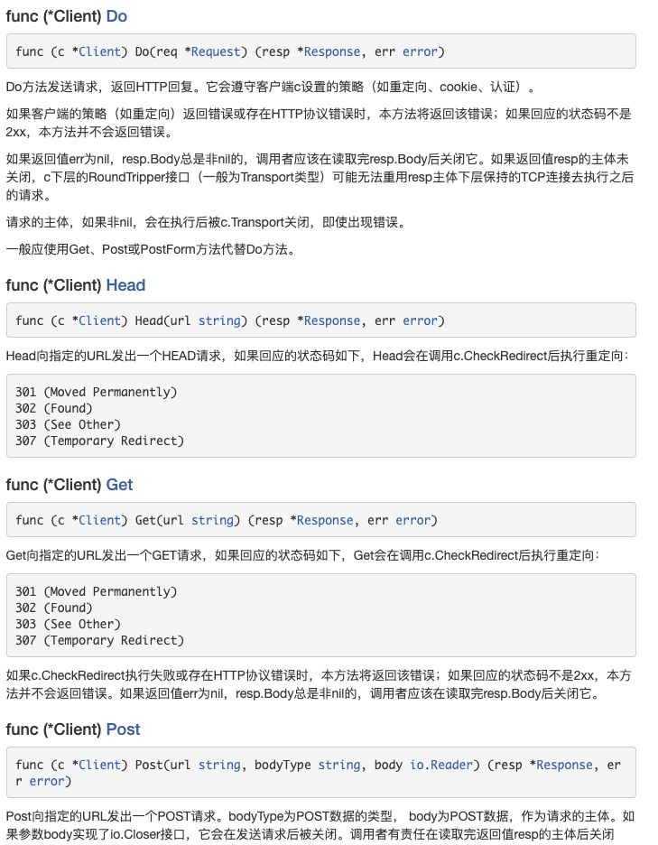
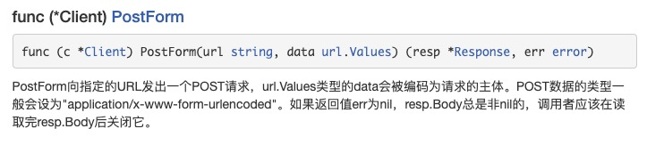
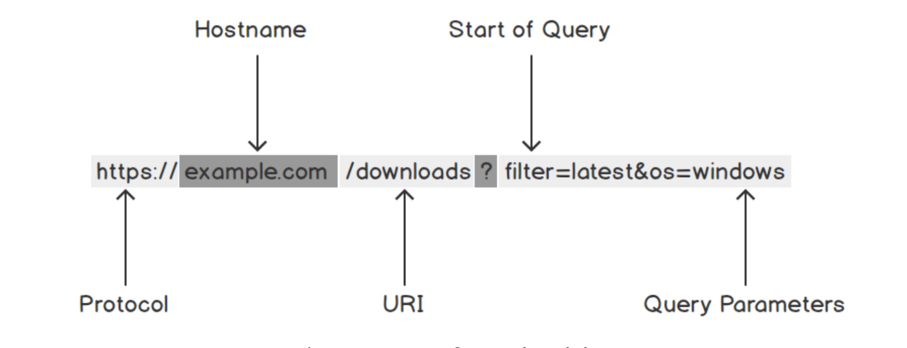

1. Clinet 代表HTTP 客户端

   Client类型代表HTTP客户端。它的零值（DefaultClient）是一个可用的使用DefaultTransport的客户端。

   Client的Transport字段一般会含有内部状态（缓存TCP连接），因此Client类型值应尽量被重用而不是每次需要都创建新的。Client类型值可以安全的被多个go程同时使用。

   Client类型的层次比RoundTripper接口（如Transport）高，还会管理HTTP的cookie和重定向等细节

2. 发送请求，post，get,head,put,delete 等请求

   
   

3. url

   