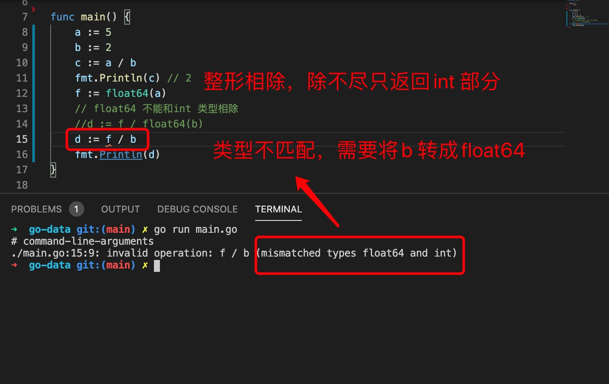

1. go 运算符号有 

+ 加 (+) 

   数字用于加法

   字符串用于拼接字符串

        a := 12
        b := 13
        c := a + b
        fmt.Println(c) // 25
        d := "hello"
        e := " 中国"
        f := d + e
        fmt.Println(f) //hello 中国

+ 减（-）

+ 乘（*）

+ 除 (/)

   

+ 求余 (%)

        func main() {
            a := 5
            b := 2
            c := a % b
            fmt.Println(c) // 返回余数，5/2 商2余1
        }

+ 自加和自减

   go 语言只支持后面自加和自减一种，而且必须单独一行

   
   