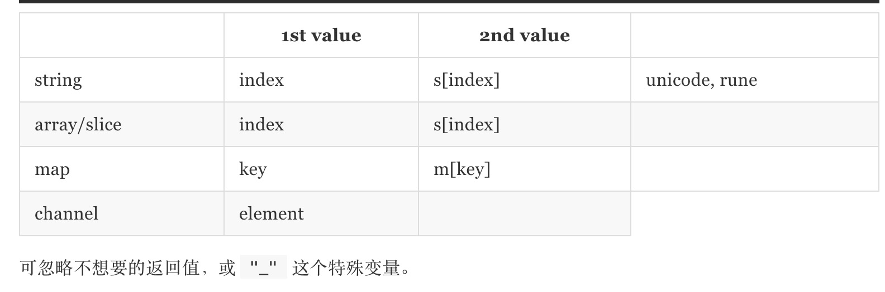
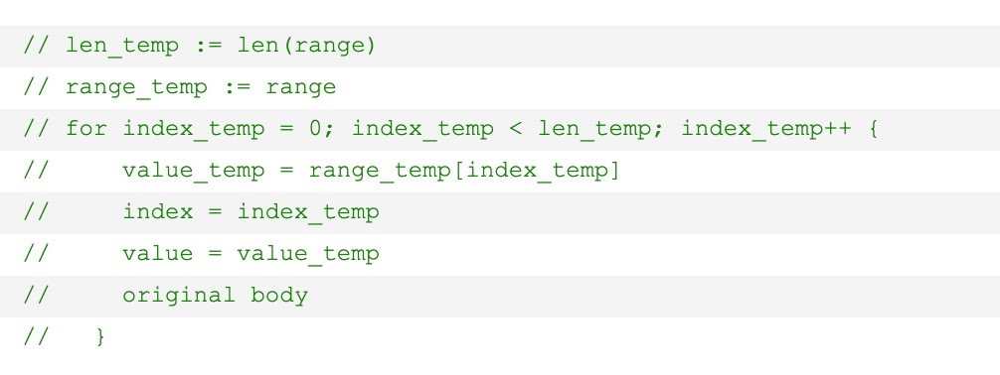
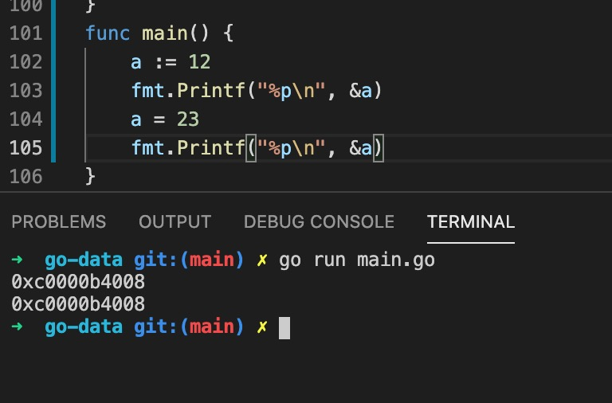
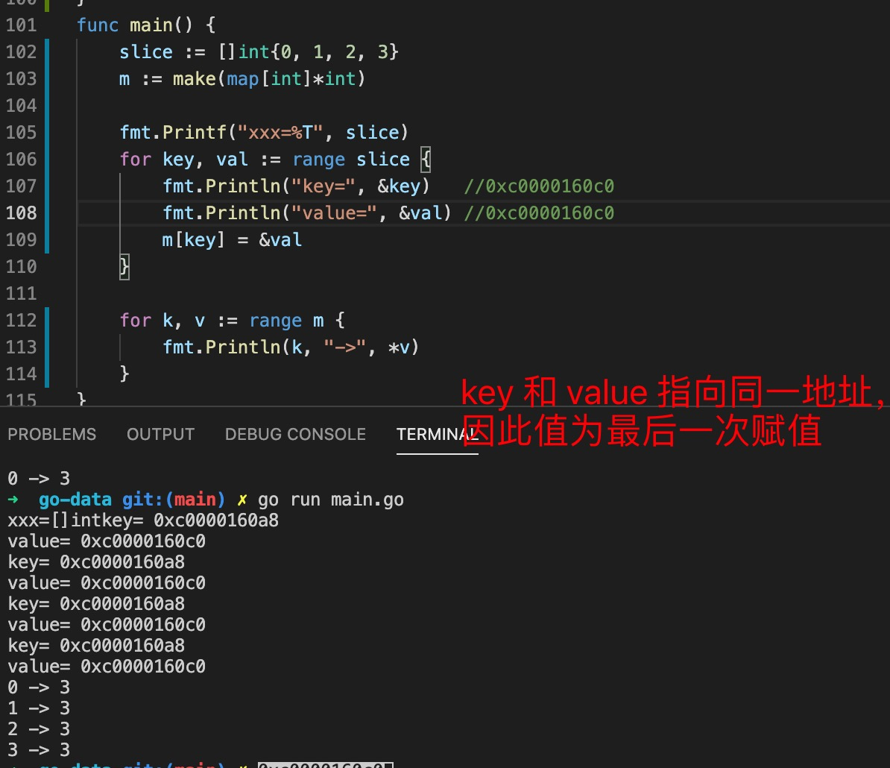
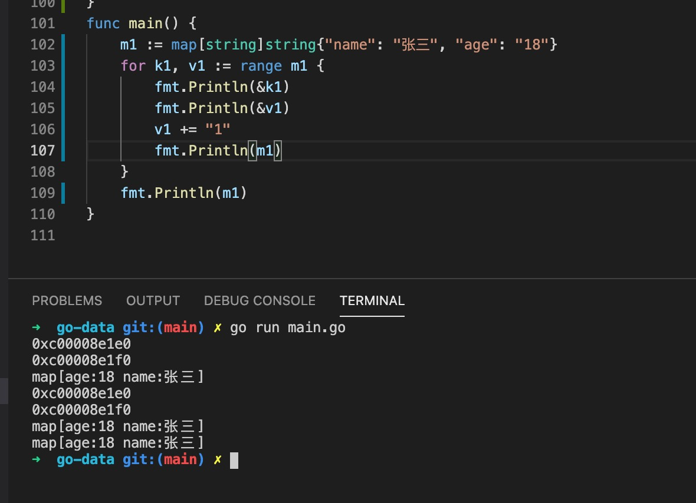

1. 在go 语言中循环只有for ，但是for 有很多变体

+ for 无限循环

        for {
            没有查询条件，会一值循环

        }

+ for 模拟while

        for left<right{
            // 当左边一直小于右边时
        }

+ for 正常循环

        for i:=0;i<len(arr);i++{

        }

        for i:=len(arr)-1;i>=0;i--{

        }

2. for range 

    

+ range 用于字符串,数组，切片时，返回的是index,value

        for index,value :=range "hello"{
            // 返回rune 类型
        }

+ range 用于map 时，返回key 和value

+ 用于channel(通道)时，返回通道

3. for range 陷阱

   for range 会拷贝一个key 和 value 的副本，直接修改key,value 不会影响原来的数据
   

    for-range 其实是语法糖，内部调用还是 for 循环，初始化会拷贝带遍历的列表（如 array，slice，map），***然后每次遍历的v都是对同一个元素的遍历赋值***。也就是说如果直接对v取地址，最终只会拿到一个地址，而对应的值就是最后遍历的那个元素所附给v的值。
  
    每次变量都是对value_temp 这个变量赋值

    > 对同一个变量取地址和赋值

    

    按照源码所示，每次都是给value_temp 赋值，并返回给v,因此当for range 循环时，取value 的地址会指向同一个内存地址，值为最后一次的值

    

    > key,value 为副本，改变其值不影响原来的值

    