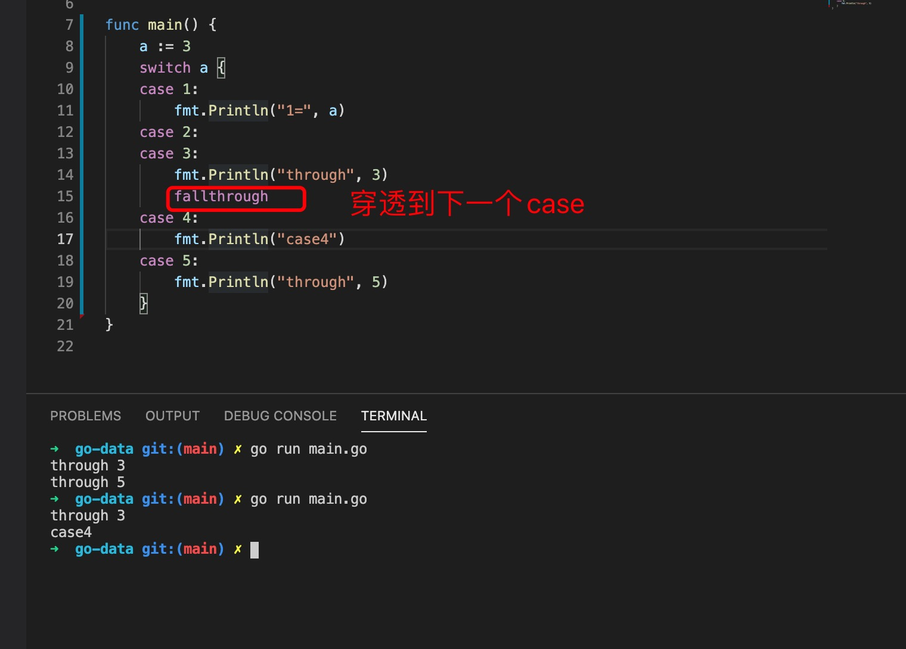
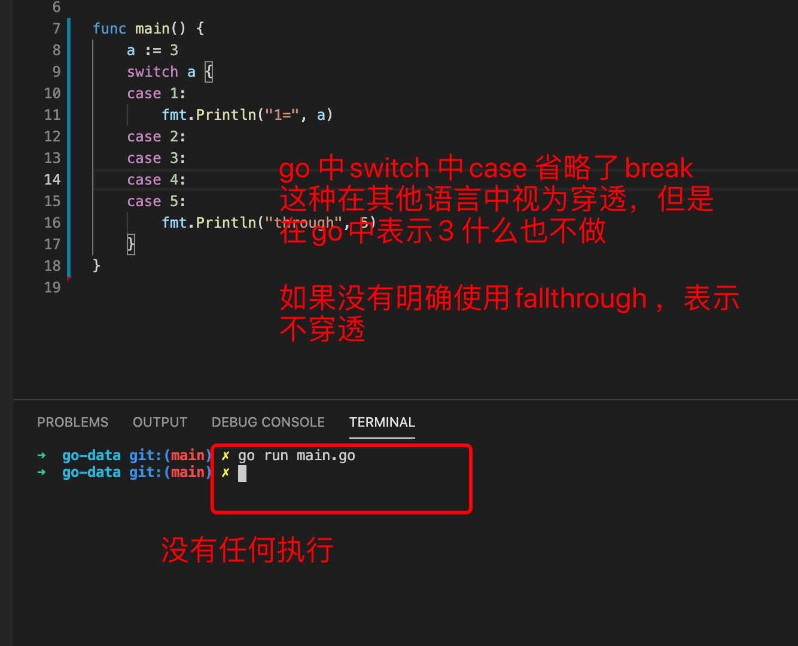
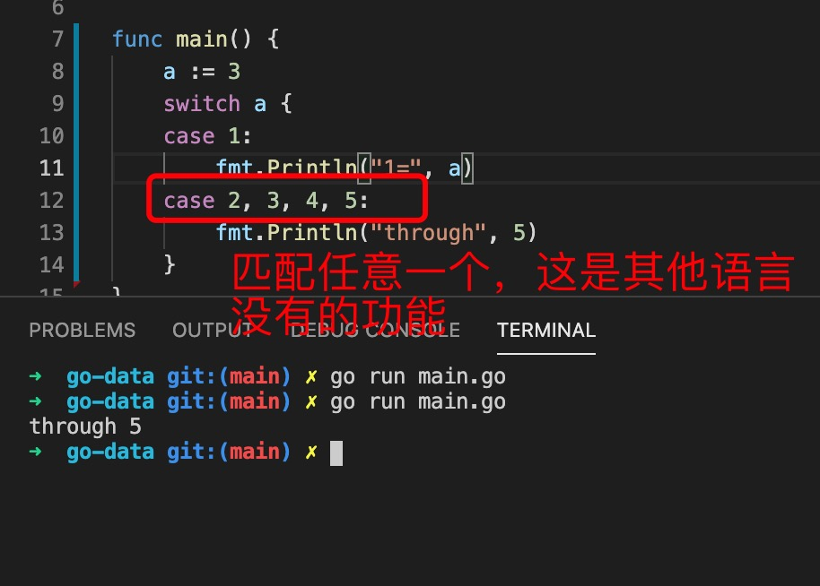
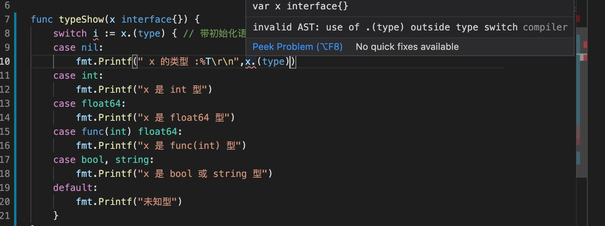
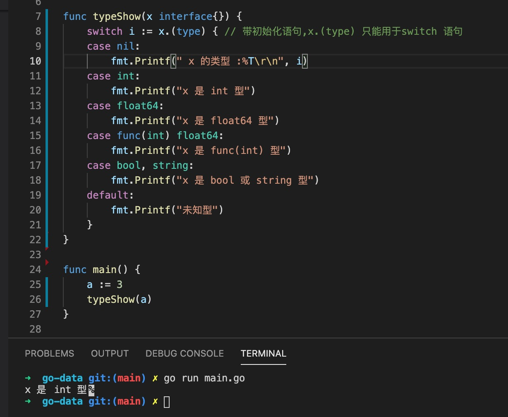

1. go 语言中的switch 和其他类型语言中的switch 不一样，case 末尾可以省略break

        switch var1 {
            case val1:
                ...
            case val2:
                ...
            default: // 默认，表示所有条件都不匹配
                ...
        }

2. case多个匹配条件

        switch marks {
            case 90: grade = "A"
            case 80: grade = "B"
            case 50,60,70 : grade = "C"
            default: grade = "D"  
        }

3. case 可以是条件语句

        switch {
            case grade == "A" :
                fmt.Printf("优秀!\n" )     
            case grade == "B", grade == "C" :
                fmt.Printf("良好\n" )      
            case grade == "D" :
                fmt.Printf("及格\n" )      
            case grade == "F":
                fmt.Printf("不及格\n" )
            default:
                fmt.Printf("差\n" )
         }

4. fallthrougn 穿透

   

   

   

5. x.(type)

   

   