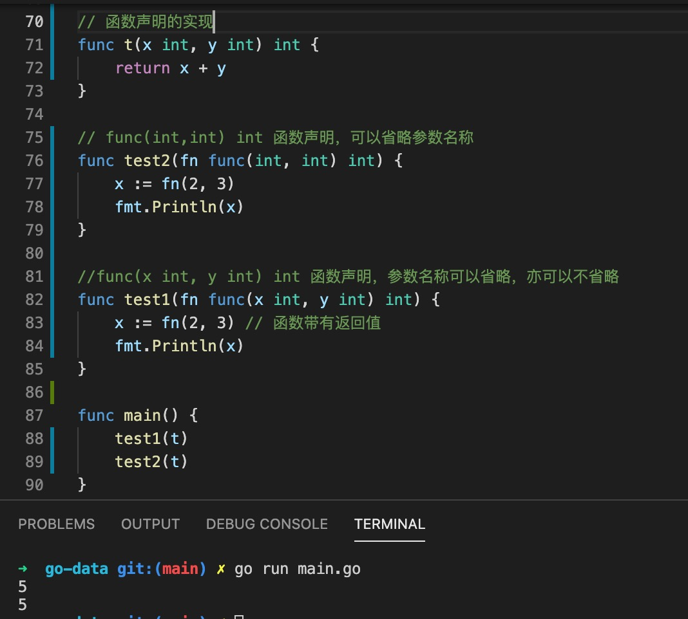

1. 形参和实参

+ 形参： 函数定义时的参数，称为形参

      func hello(a int,b string){
         a,b 为形参
      }

+ 实参： 函数调用时的参数，称为实参

      hello(2,"hello") // 2 和 hello 为实参

2. 函数参数可以是任意类型，比如数字，字符串，切片，指针，设置可以是一个函数

   

3. 不定参数

    go 语言支持不定参数，使用...,但是参数必须是同一种类型
    
    不定参数是一个slice 类型

            func myfunc(args ...int) {    //0个或多个参数
            }

            func add(a int, args …int) int {    //1个或多个参数
            }
            // 后面的参数必须是一个类型，比如此处是int 类型
            func add(a int, b int, args …int) int {    //2个或多个参数
            }

            add(1,2,3,4,5,6)

            func test(n ...int){
                var x int
                for _, i := range n {
                    x += i
                }
            }
    
    调用函数时，可以使用... 展开slice

            test([]int{1,2,3,4,5}...)

