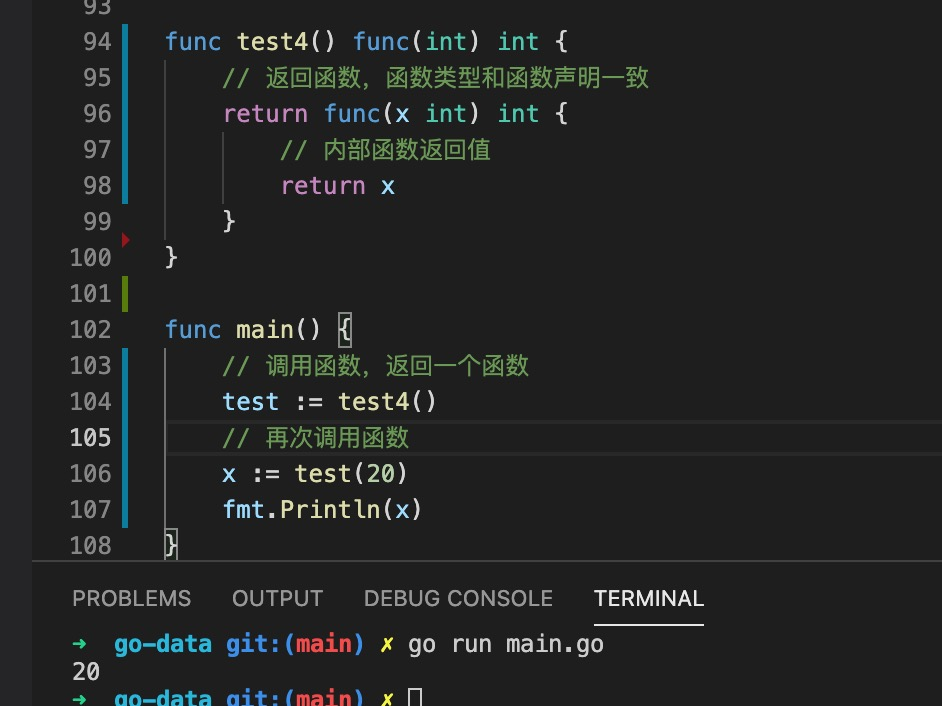

1. 函数返回值类型定义

        //rtnType 函数返回参数类型
        func funcName() rtnType{
            return type
        }

2. go 语言支持返回多个值

        func funcName() (int,string){
            return 18,"张三"
        }

3. 返回参数声明

    

4. 返回函数

    