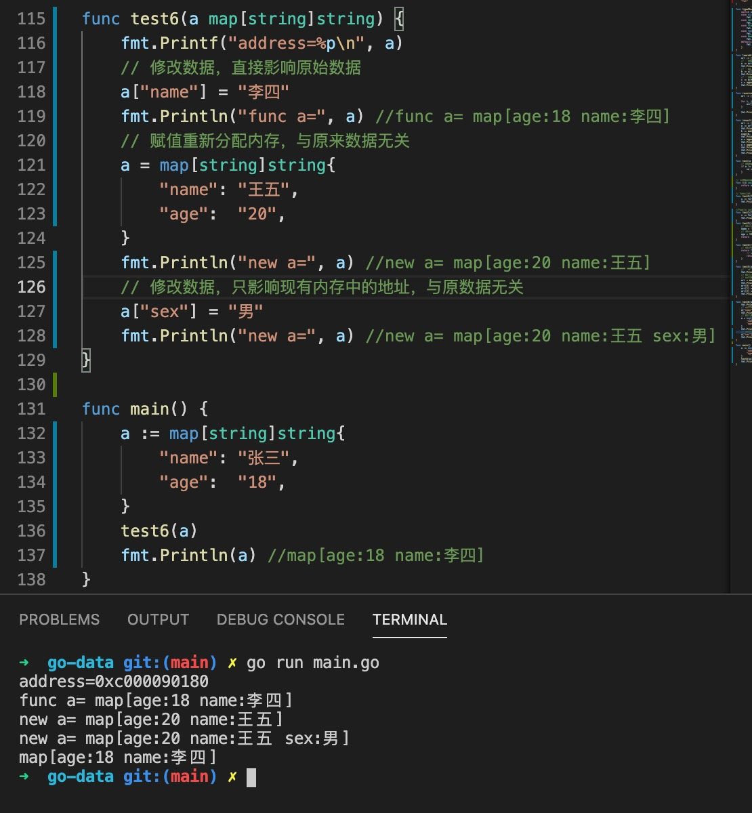

1. 值传递： 当int,bool,string 类型的变量作为参数传递给函数是，go 会拷贝变量的一个副本给形参。当函数中对形参修改时，不会影响外部的变量，因为他们指向的不是同一个地址

   值传递go 是通过stack（栈内存）

   值传递会占用更多的内存

2. 为了减少内存的占用，可以传递指针，指针指向内存的地址，只是一段简单的地址信息，

   传递指针给形参，此时形参和变量指向同一个内存地址，当函数中对形参做了修改，会影响原来的变量。这种传值叫做引用传递，传递的是变量在内存的地址

3. 传递slice,map,chan 为引用传递

   

   引用传递，在方法中修改其中的数据会修改原始数据，如下图所示：
   

   > 注意： 当使用引用传递时，方法参数作为局部变量和原始数据指向同一内存地址，改变内存中的数据相应的原始数据也会改变，但是当局部变量赋值新的值，即重新分配内存空间时，局部变量指向新的内存地址，再次改变数据不会在影响原来的数据

   

   

   