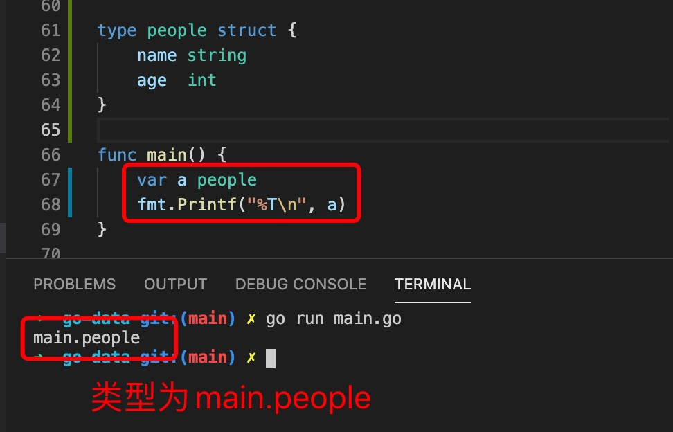
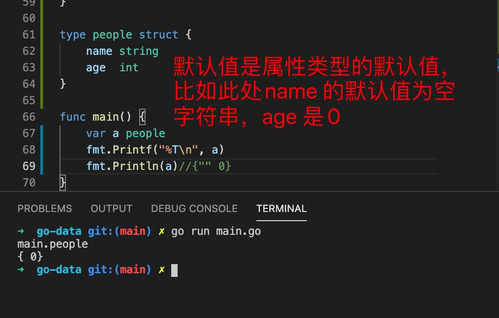
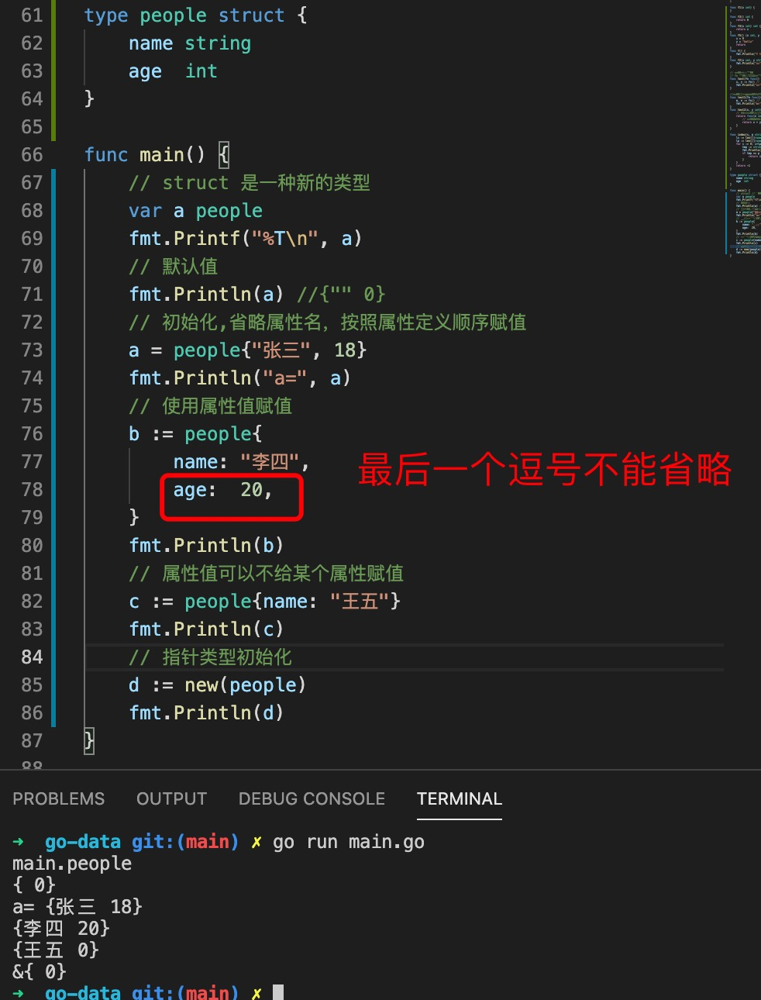
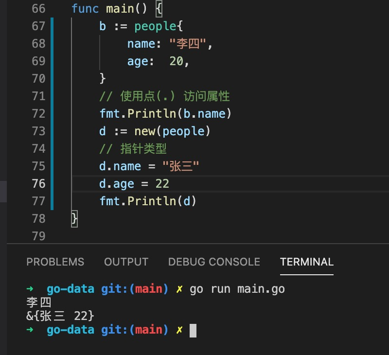

1. 在go 中没有class , 但是有struct ，可以使用struct 模拟class

        type StructName struct{
            property type
            property type 
            ....
        }

2. go 中struct 方法，和普通方法唯一的区别就是需要有一个接收器

        // 需要一个接收器，类型有两种一种是副本类型，一种是指针类型
        func (struct *structType) funcName() {

        }

3. struct 是type 声明的一种新类型

   

4. struct 是值类型，默认值是属性类型的默认值

   

5. struct 初始化

   

6. 访问和设置属性使用点(.) ，即使指针类型也可以直接使用点(.) 访问

    