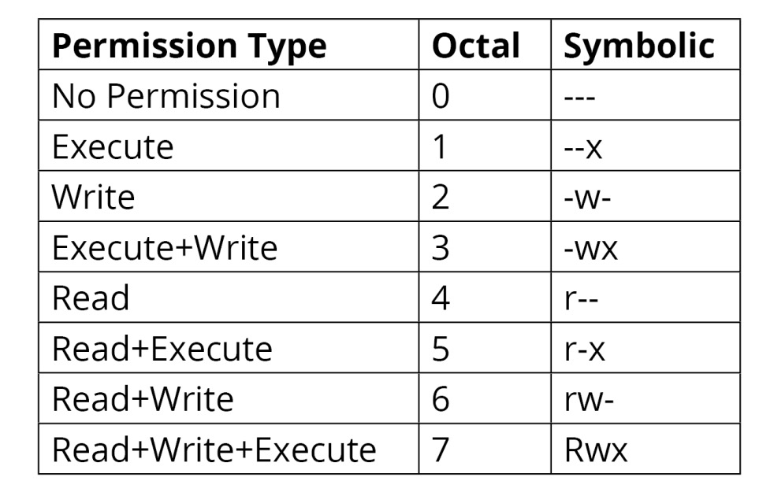
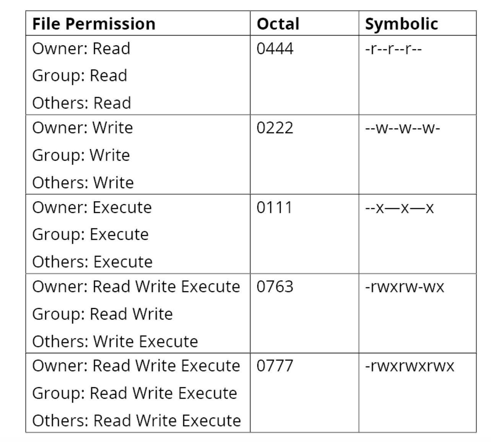
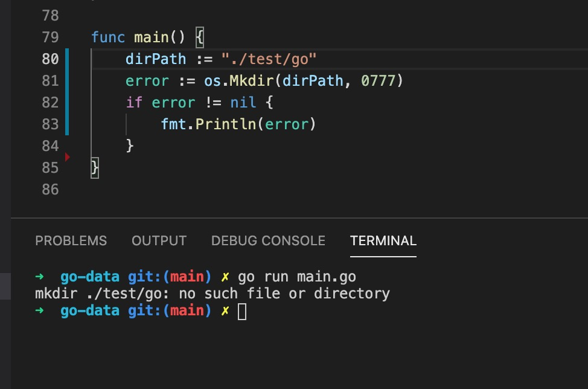
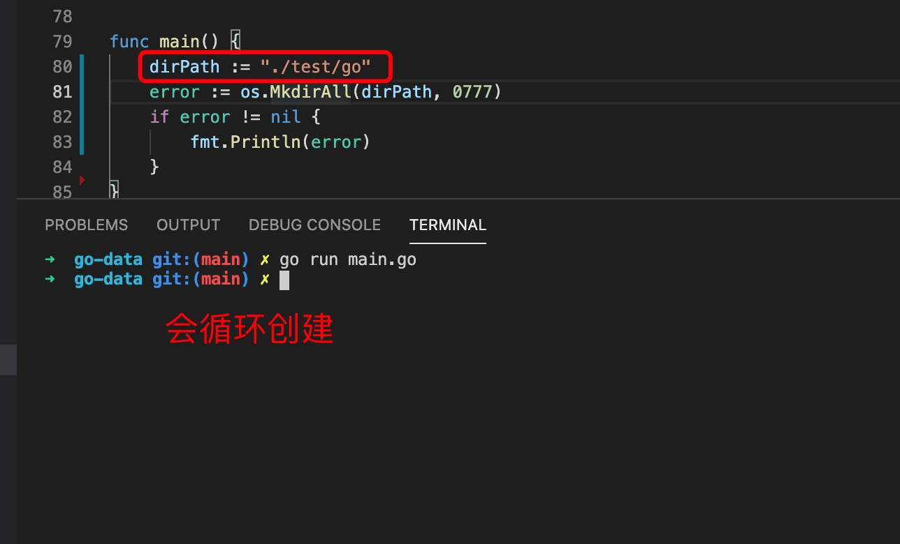
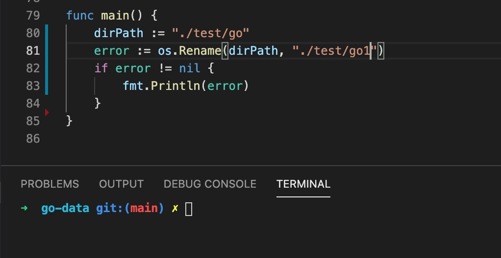

1. filemod 是依赖unit32 生成的新类型

        type FileMode uint32

        值为0777 等

        4 为可读，2 为可写，1 为可执行，0 没有权限

   
    

    

2. 文件操作常见的包括目录操作和文件和权限

> 目录

+ Getwd: 返回当前所在的根目录，即应用程序根目录

        // 返回当前文件所在的目录
        dir, error := os.Getwd()
        fmt.Println(dir)

+ 返回文件路径

        _, file, line, ok := runtime.Caller(0)

        file 为文件路径    
        // 获取文件目录
        path.Dir(file)///Users/slashare/go/src/go-data/num
        // 获取当前文件名称
        path.base(file)   // num.go
        // Split 获取目录和文件名称
        dir,filename:=path.Split(file) // 
        // 获取文件后缀名
        ext:=path.Ext(file) //.go

+ 创建目录Mkdir

    func Mkdir(name string, perm FileMode) error

    Mkdir 只能创建单个目录，如果是带有子目录的，必须父目录存在

    

+ 创建目录MkdirAll

    func MkdirAll(path string, perm FileMode) error

    MkdirAll使用指定的权限和名称创建一个目录，包括任何必要的上级目录，并返回nil，否则返回错误

    

+ 更新目录名称

    

+ 删除目录名称

    

