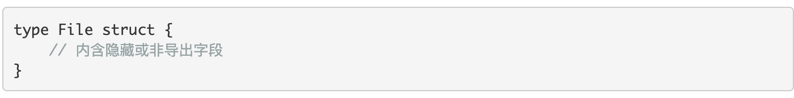
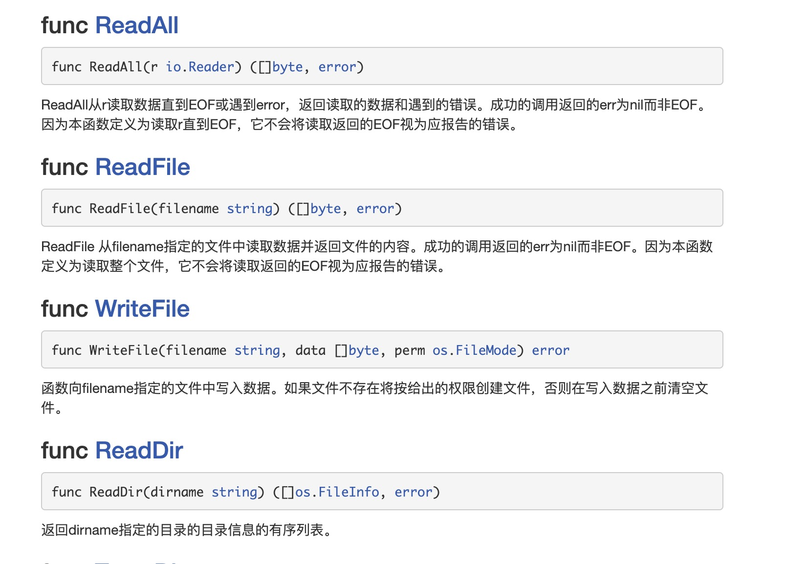

1. 在go语言中，file 操作在os 包中，是一个struct 结构体

   

2. file 实例化

+ 创建一个新的文件，返回file 指针实例

   func Create(name string) (file *File, err error)

   Create采用模式0666（任何人都可读写，不可执行）创建一个名为name的文件，如果文件已存在会截断它（为空文件）。如果成功，返回的文件对象可用于I/O；对应的文件描述符具有O_RDWR模式。如果出错，错误底层类型是*PathError

+ 打开一个文件，返回file 指针

   func Open(name string) (file *File, err error)

   Open打开一个文件用于读取。如果操作成功，返回的文件对象的方法可用于读取数据；***对应的文件描述符具有O_RDONLY模式***。如果出错，错误底层类型是*PathError。

3. 文件对象方法

+ 获取文件名字

   func (f *File) Name() string

+ 获取文件详情

   func (f *File) Stat() (fi FileInfo, err error)

+ 修改文件模式

   func (f *File) Chmod(mode FileMode) error

+ 写入文件

   func (f *File) Write(b []byte) (n int, err error)

   Write向文件中写入len(b)字节数据。它返回写入的字节数和可能遇到的任何错误。如果返回值n!=len(b)，本方法会返回一个非nil的错误。

+ 写入字符串

   func (f *File) WriteString(s string) (ret int, err error)

   

+ 设置写入位置写入数据

   func (f *File) Seek(offset int64, whence int) (ret int64, err error)

   Seek设置下一次读/写的位置。offset为相对偏移量，而whence决定相对位置：0为相对文件开头，1为相对当前位置，***2为相对文件结尾***。它返回新的偏移量（相对开头）和可能的错误。

+ 关闭

   func (f *File) Close() error

   Close关闭文件f，使文件不能用于读写。它返回可能出现的错误。

4. 另外的文件操作在ioutil 库中

    

5. 写入图片
   
    