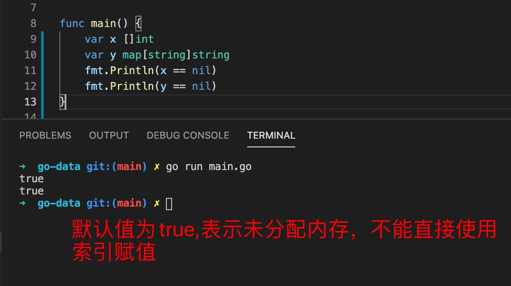

1. 在go 语言中slice,map,chan 为引用类型，声明变量默认值返回nil, 不能直接操作

   

2. make 用于slice,map,chan 的初始化，分配内存

+ slice: make(sliceType,length,cap)

        make([]int,10) // 此时length=cap=10
        make([]int,5,20)// length=5,cap=20
        //[0 0 0 0 0] // 元素长度的默认值为类型的默认值

+ map: make(sliceType,length) // 键值的个数